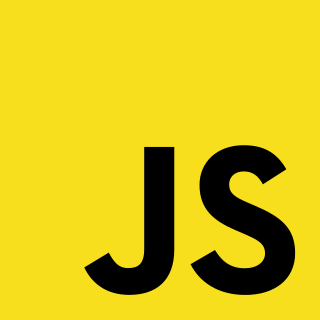

# Stack tecnológico

Aqui tienes un resumen de todas las tecnologías y herramientas que utilizaremos a lo largo de este proyecto:

**MEJOR CREMOS UNA IMAGEN EENTERA CON FIGMA
**

    
  HTML5 Para la maquetación 

  

  CSS para los estilos

  

