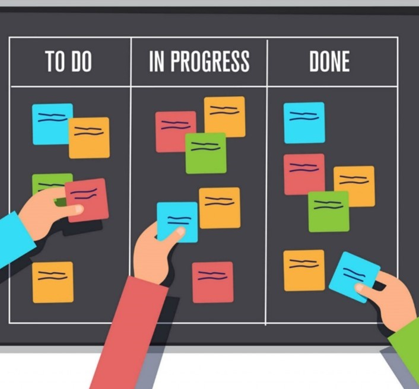
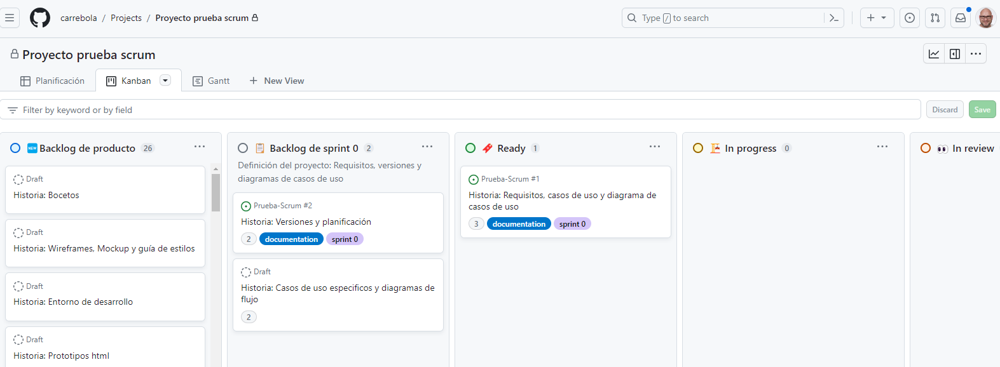
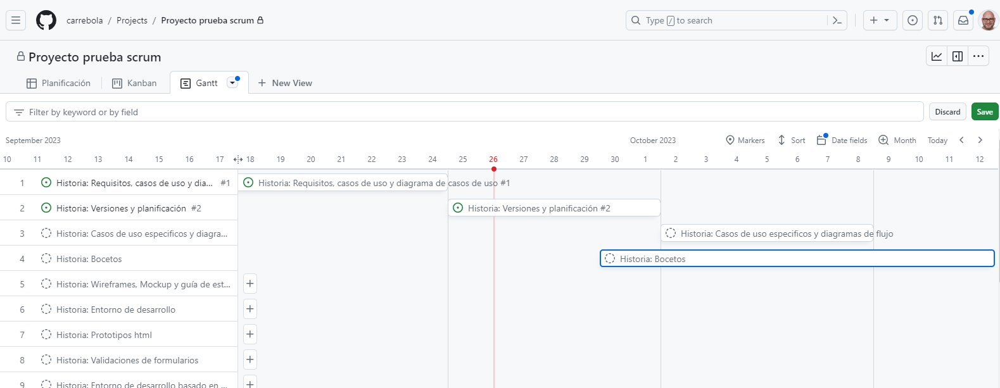

Una explicación de la terminología Agile y como se usa para planificar el desarrollo de este proyecto en sus diferentes versiones

## ¿Qué son las metodología Agile?
Agile es un **enfoque de desarrollo de proyectos** que se basa en la flexibilidad, la colaboración y la **entrega incremental de software**. 

Este enfoque se utiliza para **planificar y gestionar proyectos** de manera que puedan adaptarse a los cambios en los requisitos del cliente y a las condiciones cambiantes del mercado. 

## Terminología
Os explico la terminología Agile y cómo se usa en la planificación del desarrollo de proyectos en sus diferentes versiones:

- **User Stories (Historias de Usuario)**: Las historias de usuario son descripciones breves y centradas en el usuario de las funcionalidades o características que se deben desarrollar. Están escritas en lenguaje natural y se utilizan para representar los requisitos desde la perspectiva del usuario.

- **Product Backlog (Lista de Producto)**: Es una lista priorizada de todas las historias de usuario y características que se desean incluir en el producto. El backlog se actualiza y reordena de forma continua a medida que se obtiene más información o cambian las prioridades.

- **Sprints**: Un sprint es un período de tiempo fijo y corto (generalmente de 2 a 4 semanas) durante el cual se trabaja en un conjunto específico de historias de usuario del backlog. Los sprints permiten una entrega incremental y regular de funcionalidades.

- **Sprint Planning (Planificación de Sprint)**: En la planificación de sprint, el equipo selecciona las historias de usuario del backlog que se abordarán en el próximo sprint. Esto implica estimar la complejidad y el esfuerzo necesario para cada historia y comprometerse con un conjunto de trabajo para el sprint.

- **Daily Standup (Reunión Diaria)**: También conocida como la reunión de scrum, es **una breve reunión diaria** en la que el equipo se pone al día sobre lo que ha hecho, lo que planea hacer y si hay obstáculos en su camino. Esto fomenta la comunicación y la colaboración.

- **Sprint Review (Revisión de Sprint)**: Al final de cada sprint, se realiza una **revisión para demostrar las funcionalidades desarrolladas** y obtener retroalimentación del cliente o del equipo de stakeholders. Esto ayuda a ajustar las prioridades del backlog.

- **Sprint Retrospective (Retrospectiva de Sprint)**: Después de la revisión de sprint, el equipo realiza una retrospectiva para analizar lo que funcionó bien y lo que se puede mejorar en el proceso. Esto facilita la adaptación continua y la mejora.

- **Burndown Chart (Gráfico de Burn-Down)**: Es una representación visual del trabajo restante en el sprint. Muestra cómo el equipo está progresando hacia la finalización de las tareas planificadas para el sprint.

- **Velocity (Velocidad)**: La velocidad es una medida de la cantidad de trabajo que un equipo puede completar en un sprint. Se utiliza para estimar cuántas historias de usuario se pueden abordar en futuros sprints.

En cuanto a las diferentes **versiones de Agile**, existen varios marcos y metodologías, como **Scrum, Kanban**, Lean, eXtreme Programming (XP) y más. Cada uno tiene sus propias prácticas y enfoques, pero todos comparten el valor fundamental de la flexibilidad y la adaptación continua en el desarrollo de software. 

La elección de la metodología Agile adecuada depende de las necesidades específicas del proyecto y del equipo de desarrollo. Cada uno de estos enfoques se adapta a diferentes contextos y preferencias organizativas.

### SCRUM

### KANBAM

## Diferencias entre Scrum y Kanban

Scrum y Kanban son dos marcos de trabajo dentro de la metodología Agile que se utilizan para gestionar y mejorar el proceso de desarrollo de proyectos. Aunque ambos comparten la filosofía Agile de flexibilidad y entrega incremental, tienen diferencias significativas en la forma en que organizan y gestionan el trabajo. 

Vamos a comparar las principales diferencias entre Scrum y Kanban:

**1. Roles y estructura del equipo:**

- **Scrum**: Scrum define roles específicos, como Scrum Master, Product Owner y Equipo de Desarrollo. El Scrum Master se encarga de facilitar el proceso, el Product Owner gestiona el backlog y el Equipo de Desarrollo trabaja en las historias de usuario durante los sprints. Los sprints son fijos y tienen una duración predefinida.

- **Kanban**: Kanban no impone roles específicos ni estructuras de equipo. Puede ser utilizado en equipos existentes sin cambios significativos en la organización. No hay sprints ni roles como el Scrum Master o el Product Owner en Kanban.

**2. Planificación y ciclos de trabajo:**

- **Scrum**: Scrum utiliza sprints, que son ciclos de trabajo fijos con una duración generalmente de 2 a 4 semanas. En la planificación de sprint, se selecciona un conjunto de historias de usuario del backlog para ser completadas durante el sprint.

- **Kanban**: Kanban no tiene sprints. En su lugar, utiliza un flujo continuo de trabajo. Las historias de usuario se mueven a través del tablero Kanban según su estado (por ejemplo, "Por hacer," "En progreso," "Completado"). No hay límite de tiempo fijo para completar tareas.

**3. Priorización y cambios:**

- **Scrum**: Durante un sprint de Scrum, no se permiten cambios en las historias de usuario seleccionadas. Los cambios significativos deben esperar hasta el siguiente sprint. La priorización se establece al comienzo de cada sprint.

- **Kanban**: Kanban permite cambios y ajustes en tiempo real. Las historias de usuario pueden agregarse, eliminarse o reordenarse en el backlog en cualquier momento. Esto proporciona mayor flexibilidad para adaptarse a los cambios en los requisitos del cliente o las prioridades del negocio.

**4. Control del trabajo en proceso (WIP):**
- **Scrum**: Scrum no impone límites estrictos al trabajo en proceso dentro de un sprint, pero se espera que el equipo complete las historias de usuario que se comprometió a abordar en el sprint actual antes de tomar nuevas tareas.

- **Kanban**: Kanban se enfoca en limitar el trabajo en proceso (WIP) para evitar la sobrecarga del equipo. Cada columna en el tablero Kanban tiene un límite WIP, lo que significa que no se puede trabajar en más elementos de los permitidos en esa columna a la vez.

¿Y si utilizamos lo mejor de estos dos mundos? 
## SCRUMBAN

**ScrumBan** es como la **fusión de Scrum y Kanban**. Toma la estructura y las reuniones de Scrum, como los sprints y las reuniones diarias, y le agrega el flujo continuo y la limitación del trabajo en proceso (WIP) de Kanban.

En resumen, en ScrumBan:

- Aún tienes sprints como en Scrum, pero con más flexibilidad.
- Usas un tablero Kanban para visualizar el trabajo y limitas cuánto puedes hacer a la vez.
- Mantienes algunas reuniones de Scrum para estar al tanto y mejorar constantemente.

Es una forma intermedia que permite adaptarse a los cambios rápidos y mantener un flujo de trabajo constante. Perfecto si necesitas estructura pero también flexibilidad. **¡Es lo mejor de ambos mundos!**

### Roles en Kanban
En ScrumBan, como en otros enfoques de desarrollo Agile, los roles tienden a ser más flexibles que en Scrum puro, ya que ScrumBan es una combinación de Scrum y Kanban. 

Aquí están los roles comunes que pueden estar involucrados en un equipo que practica ScrumBan:

- **Equipo de Desarrollo:** Este equipo es responsable de llevar a cabo las tareas y actividades necesarias para completar las historias de usuario y las tareas del proyecto. En ScrumBan, el equipo de desarrollo tiene una mayor flexibilidad para tomar y entregar tareas a medida que están listas, en lugar de esperar hasta el final de un sprint.

- **Scrum Master (Facilitador)**: Aunque ScrumBan no enfatiza la estructura de roles de Scrum, un Scrum Master puede desempeñar un papel en la facilitación de reuniones y la eliminación de obstáculos. Sin embargo, su papel puede ser menos formal que en Scrum tradicional.

- **Product Owner (Propietario del Producto)**: El Product Owner sigue siendo responsable de gestionar el backlog de producto, priorizar las historias de usuario y mantener una visión clara del producto. En ScrumBan, la colaboración entre el Product Owner y el equipo de desarrollo es clave para ajustar las prioridades según sea necesario.

- **Stakeholders (Partes Interesadas):** Las partes interesadas siguen siendo una parte importante en ScrumBan. Proporcionan comentarios y dirección, y pueden influir en la priorización del trabajo en el backlog de producto.

Es importante destacar que en ScrumBan, los roles tienden a ser más fluidos y colaborativos que en Scrum tradicional. El enfoque se centra en la entrega continua y la flexibilidad, lo que significa que el equipo de desarrollo puede seleccionar y trabajar en elementos del backlog de producto a medida que están listos, en lugar de comprometerse con un conjunto fijo de historias de usuario al comienzo de un sprint.

En general, los roles en ScrumBan están diseñados para apoyar la entrega continua y la adaptabilidad, lo que permite al equipo responder rápidamente a los cambios en los requisitos y las prioridades del proyecto. La estructura de roles puede variar según las necesidades y la cultura del equipo y la organización.

## Planificación del Desarrollo del Proyecto
### 1. Definición de Objetivos y Tareas
- Backlog de Producto: Aquí definimos las metas del proyecto en forma de historias de usuario y sus tareas asociadas.
### 2. Organización de Trabajo por Sprints
- Planificación de Sprints: En esta etapa, organizamos el trabajo por ciclos de tiempo definidos. Esto incluye:
- Backlog de Sprint: La lista de tareas específicas seleccionadas para el sprint actual.
- Objetivos del Sprint: Lo que buscamos lograr durante este período, junto con los criterios que deben cumplir las historias de usuario.
### 3. Gestión del Tiempo y los Recursos
- Temporización y Secuencia: Para garantizar que todo se realice a tiempo y de manera eficiente, consideramos lo siguiente:
  - Estimación Temporal: Cuánto tiempo llevará cada tarea o historia.
  - Secuenciación: El orden en que abordamos las historias.
  - Asignación de Recursos: Quién es responsable de cada tarea o historia.
  - Diagrama de Gantt: Una representación visual de la planificación temporal.
### 4. Seguimiento del Progreso
- Seguimiento del Progreso del Proyecto: A medida que avanzamos, monitoreamos y ajustamos constantemente para asegurarnos de que todo esté en camino y se cumplan los objetivos del proyecto.

## Ejemplos
### Ejemplo de tablero kanban con GitHub Project

### Ejemplo de diagrama de Gantt con GitHub Project

