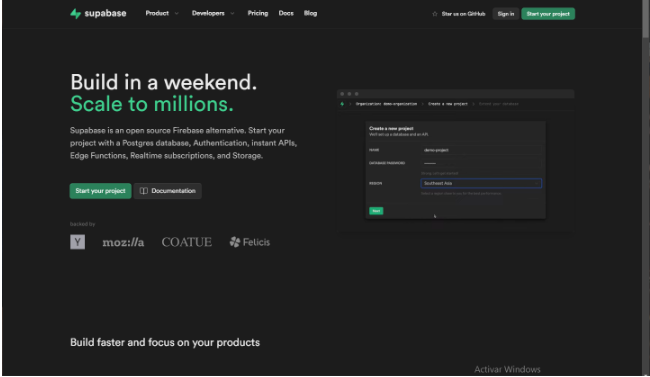
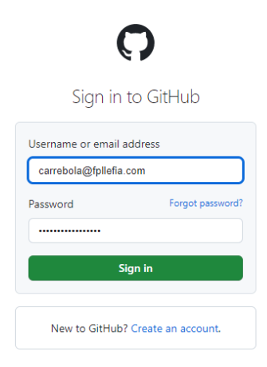
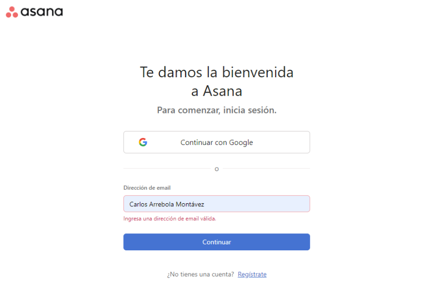
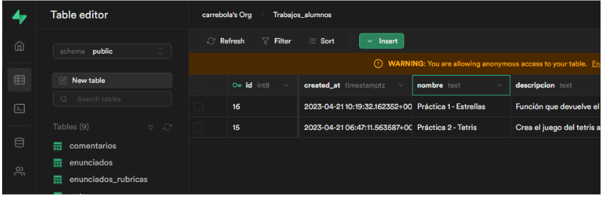
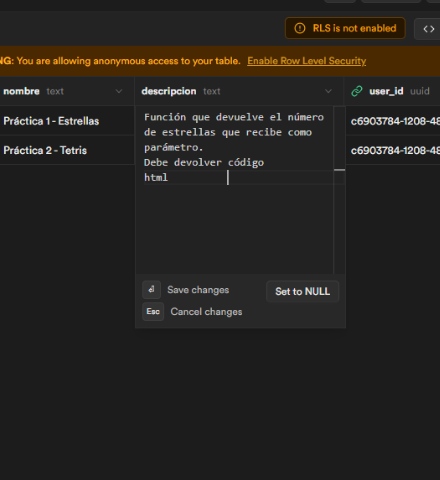
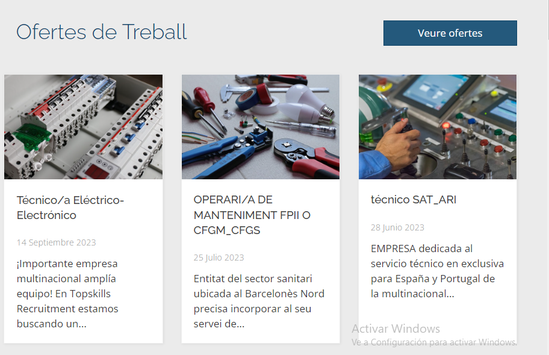

Ahora que tenemos claro las **especificaciones** del proyecto **y a quíen va dirigido**, es hora de plantearnos cómo resolver las necesidades de los usuarios. 

Un buena forma de comenzar es fijarnos en **cómo lo hacen otras aplicaciones web**, para acabar adoptando las mejores soluciones...

> Sí, vale, **nos vamos a copiar, ¡¿qué pasa?!**  😒

A esta técnica se la conoce como **Benchmarking**, o estudio de la competencia.

:::info Qué es el Benchmarking

  
El benchmarking es una técnica valiosa en el proceso de diseño de una aplicación web...

En este contexto, el benchmarking implica la evaluación y comparación del diseño y la funcionalidad de la aplicación web con respecto a otras aplicaciones web en el mismo mercado o industria.

La empresa diseñadora de la aplicación web puede utilizar el benchmarking para identificar las mejores prácticas en diseño de aplicaciones web en su industria, y luego adaptarlas o mejorarlas en su propia aplicación. Esto puede ayudar a la empresa a crear una aplicación web más atractiva, fácil de usar y funcional.

Por ejemplo, si la empresa está diseñando una aplicación web de comercio electrónico, puede realizar benchmarking para evaluar cómo otras aplicaciones web de comercio electrónico exitosas presentan sus productos, cómo facilitan el proceso de compra y cómo se comunican con sus clientes. Al hacerlo, la empresa puede identificar las mejores prácticas en diseño de aplicaciones web de comercio electrónico y aplicarlas a su propia aplicación para mejorar la experiencia del usuario y aumentar las ventas.

En resumen, el benchmarking puede ser una herramienta valiosa para la empresa diseñadora de la aplicación web al permitirle aprender de las mejores prácticas de otras aplicaciones web en su industria y adaptarlas para mejorar su propia aplicación.

:::

## ¡Manos a la obra!
Vamos a plantearnos como solucionar algunos de los problemas y revisaremos como lo hacen otras empresas. Vamos dividir la busqueda en 4 conceptos básicos:

### 1. Identidad gráfica
Mantendremos en la parte superior izquierda el logo de la app junto al nombre, en una barra superior que incluirá el menú principal, y que se mantendrá constante en toda la aplicación.

Algunos ejemplos son la web de asana o de supabase:

### 2. Sistema de registro y login
Para la pantalla de inicio de sesión utilizaremos un formulario centrado en la pantalla donde solicitaremos el email y la contraseña. 

Para el registro incluiremos también las opciones de recordar contraseña y crear cuenta. El método de validación incluirá un mensaje en la parte inferior del input en caso de que el formato no sea el esperado. Algunos ejemplos pueden ser la web de GitHub o Asana

### 3. Panel de control de administrador
En el panel de administración resulta interesante permitir modificar los datos en la misma tabla, incluyendo un formulario para cada fila, tal y como se muestra en el panel de supabase:

### 4. Visualización de contenidos

La visualización de contenidos mediante tablas es quizás la opción más interesante. No obstante, para dispositivos de dimensiones más pequeñas que una pantalla de ordenador, quizás es mejor optar por la visualización mediante tarjetas.

