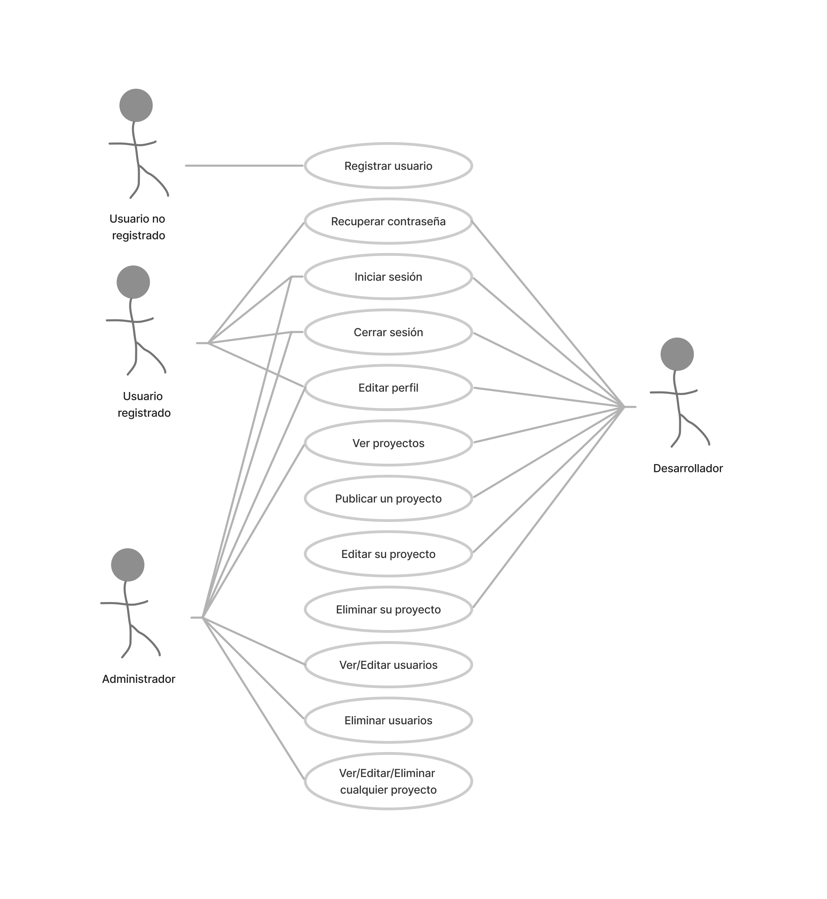

---

title: Requesitos y diagrama de casos de uso
tags:
  - Requisitos
position: 10

---

Vamos a definir los **casos de uso para la versión 1** de nuestro proyecto. Una primera aproximación podría ser la siguiente:

## Casos de uso. Definición básica

- **Registrar usuario**: Un usuario puede registrarse en la plataforma proporcionando su nombre, apellidos, email y contraseña.
- **Recuperar contraseña**: Un usuario registrado puede solicitar la recuperación de su contraseña en caso de que la haya olvidado. Para ello, se le enviará un correo electrónico con las instrucciones para restablecer su contraseña.
- **Iniciar sesión**: Un usuario registrado puede iniciar sesión en la plataforma proporcionando su email y contraseña.
- **Cerrar sesión**: Un usuario puede cerrar su sesión en la plataforma en cualquier momento.
- **Editar perfil**: Un usuario registrado puede editar su perfil, actualizando su nombre, apellidos, email o contraseña.
- **Ver proyectos**: Un usuario registrado puede ver un listado de proyectos publicados por los desarrolladores.
- **Publicar proyecto**: Un usuario con el perfil de desarrollador puede publicar un proyecto proporcionando información como nombre, descripción, imagen representativa, enlaces a servidor de pruebas y repositorio de código, estado del proyecto, etc.
- **Editar proyecto**: Un usuario con el perfil de desarrollador puede editar un proyecto que haya publicado previamente, actualizando la información del proyecto.
- **Eliminar proyecto**: Un usuario con el perfil de desarrollador puede eliminar un proyecto que haya publicado previamente.
- **Ver/Editar usuarios**: Un adminsrador puede ver una tabla con todos los usuarios que hay registrados y editar la información, incluido el ROL de usuario.
- **Eliminar usuario**: Un administrador puede eliminar cualquier usuario registrado en la plataforma.

## Diagrama de casos de uso

Para tener la información de manera gráfica vamos a utilizar uno de los **diagramas UML** que aprendimos a hacer el curso pasado: 

:::info

  
¿Qué es un diagrama UML?

  **UML**, que significa Lenguaje de Modelado Unificado (Unified Modeling Language, en inglés), es un lenguaje estándar utilizado en el desarrollo de software para visualizar, especificar, construir y documentar los artefactos de un sistema. Los diagramas UML son representaciones gráficas utilizadas en UML para modelar diferentes aspectos del sistema.

  **Existen varios tipos de diagramas UML**, cada uno de los cuales se enfoca en un aspecto específico del sistema y proporciona diferentes niveles de detalle. Algunos de los diagramas UML más comunes son:
  
  
  - Diagrama de casos de uso: describe las interacciones entre los actores y el sistema, mostrando qué funcionalidades proporciona el sistema a los usuarios.

  - Diagrama de clases: representa la estructura estática del sistema, mostrando las clases, sus atributos, métodos y las relaciones entre ellas.

  - Diagrama de secuencia: muestra la interacción entre los objetos en una secuencia temporal, describiendo cómo los objetos se comunican y colaboran entre sí.

  - Diagrama de actividades: describe el flujo de trabajo o los procesos empresariales en un sistema, mostrando las actividades y las decisiones que se toman en cada etapa.

  - Diagrama de componentes: muestra la estructura de componentes de un sistema, identificando los componentes y las dependencias entre ellos.

  - Diagrama de despliegue: representa la arquitectura física del sistema, mostrando cómo los componentes se distribuyen en el hardware y la red.

  Estos son solo algunos ejemplos de los diagramas UML más utilizados, pero hay otros diagramas, como el diagrama de estados, el diagrama de objetos y el diagrama de comunicación, que también se utilizan para modelar diferentes aspectos de un sistema. En general, los diagramas UML proporcionan una representación visual clara y sistemática del sistema, lo que facilita la comprensión, la comunicación y el diseño del software.
 

  
¿Qué es un diagrama de casos de uso?

  
**Un diagrama de casos de uso** es una herramienta utilizada en el análisis y diseño de sistemas de software para representar las interacciones entre los actores (usuarios o sistemas externos) y el sistema en sí. Es una representación visual que describe cómo se utilizará el sistema desde la perspectiva del usuario.
  
  En un diagrama de casos de uso, **los actores** se representan mediante figuras externas al sistema, como personas, otros sistemas o incluso dispositivos. **Los casos de uso, por otro lado, se representan como elipses** y describen las diferentes acciones o funciones que el sistema proporciona a los actores.

  
  El diagrama muestra las **relaciones entre los actores y los casos de uso** a través de líneas que conectan las figuras correspondientes. Estas líneas representan las interacciones entre los actores y el sistema, indicando qué casos de uso son accesibles para cada actor.
  
  Los casos de uso se utilizan para capturar los requisitos funcionales del sistema y proporcionar una visión general de cómo interactúan los diferentes actores con el sistema. También ayudan a identificar los distintos escenarios de uso y las relaciones entre ellos. 
  
  El diagrama de casos de uso es una herramienta valiosa para comunicar y comprender las funcionalidades clave del sistema entre los desarrolladores, los usuarios y otros interesados en el proyecto de software.
    

:::
El diagrama de casos de uso para la versión 1.0 sería el siguiente:

