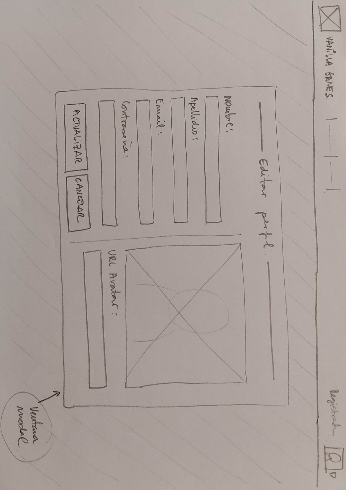

---

title: Diseño de la interfaz
tags:
  - Bocetos
position: 

---

Una vez tenemos claro las funcionalidades que debe realizar nuestra aplicación, comenzamos con **el diseño de la interfaz**.

Este proceso incluye diseñar los **bocetos**, los **wireframes** y los *mockups* ,para acabar creando los prototipos con html.

Sin duda, el primer paso, debe ser dibujar los bocetos, así que, busca un lápiz, una goma de borrar y un puñado de papel, ¡y manos a la obra!

## Deseño de Bocetos
:::info

*Recuerda que **los bocetos son dibujos a mano alzada** que representan ideas de diseño de manera rápida y no detallada. Los bocetos suelen ser utilizados al inicio del proceso de diseño para explorar diferentes ideas y soluciones de diseño de manera rápida y económica. Los bocetos son ideales para hacer borradores rápidos y para discutir ideas con colegas y clientes.* 

:::

### Home y menús usuarios

Hemos didivido la interficie en 3 zonas, el encabezado (header), el cuerpo principal (main) y el pie de página (footer).
- En el **header** vamos a alojar una barra superior fija con: el **logo** y nombre de la web (que hará las veces de link a la página principal), un **menú central genérico** (para acceder a páginas públicas), un **menú central específico** (que será diferente en función del rol de usuario logueado), y un icono (**avatar**) que permitirá ver la imagen del usuario logueado y que hará de botón para desplegar otro menú, el **menú de usuario** (que tendrá diferentes items dependiendo de si la sesió está abierta o no y del tipo de rol que tenga el usuario logueado).
- El **cuerpo** (main) albergará el contenido de las páginas. Será la sección que vaya cambiando dependiendo de la página que carguemos. En la página home simplemente aparece una imagen de fondo y el nombre de la web.
- El **header** será meramente informativo. 
### Regitro de un usuario

### Iniciar sesión

### Editar mi perfil

Editar perfil será una ventana modal, es decir, se mostrará la ventana y el fondo se volverá oscuro. 

Esta ventana de edición permitirá, además de modificar los datos del usuario, **añadir una imagen de avatar**. Por el momento, en esta primera versión, podremos añadir el link de una imagen que esté alojada en un servidor. En la siguiente versión (versión 1.1) actualizaremos esta ventana para que puedan **subirse archivos** (imágenes) al servidor.
### Listado de todos los proyectos

En esta página podemos ver, en la pestaña izquierda, todos los proyectos en forma de tabla. La pestaña derecha mostrará solo los proyectos que ha subido el usuario que ha iniciado la sesión.

Al hacer clic en cualquier parte de la fila se accede al detalle del proyecto.

También tenemos un buscador que permite buscar proyectos por palabras clave en el nombre o descripción.

Las celdas de encabezado de las tablas incluyen un icono (flecha hacia arriba o hacia abajo) que permitirá ordenar la tabla por la columna en concreto.

### Listado de Mis proyectos

En esta pestaña podemos ver los trabajos pertenecientes al usuario logueado. En cada fila aparece, además, un icono para editar y borrar el proyecto correspondiente.
Por otro lado tenemos la opción de subir un nuevo proyecto.
  
  *Habría que valorar si es mejor crear un único buscador para el nombre y descripción del proyecto o dos barras de busqueda, una para cada sección, tal y como se muestra en el boceto anterior.*

### Detalle de un proyecto

Si el usuario que está viendo la información de un proyecto en concreto es el autor de dicho proyecto, aparecerá un icono para la edición del mismo.
### Nuevo proyecto / Editar un proyecto

Esta vista sirve tanto para crear un nuevo proyecto como para editarlo. 

Si el proyecto es nuevo, el botón mostrará el texto *ENVIAR*, pero si estamos editándolo aparecerá el texto *ACTUALIZAR*. Al crear o actualizar el proyecto, la web nos reenvía a la vista 'Detalle de proyecto'.
### Panel administración de proyectos

Si tienes el rol '**administrador**' aparecerá el item '*Panel administración*' en el **menú superior específico**. Este item nos permite cargar la vista '**Panel administración de proyectos**'. Desde esta vista también podemos acceder al 'Panel administración de usuarios'.

Esta vista permite **editar o borrar cualquier proyecto** haciendo click en los iconos correspondientes. La opción editar nos llevará a la vista '*Editar proyecto*'
### Panel administración de usuarios

Esta vista permite **editar los datos de los usuarios**. Por supuesto es solo accesible para los administradores.

En esta vista, el método para editar la información es diferentes. Aquí los datos **aparecen sobre 'inputs'**, de manera que al hacer clic sobre ellos, aparecerá el cursor de edición. Se pueden modificar todos los datos (en especial el '*estado*' y el '*rol*' del usuario) excepto el email.

## Primer Test de Usabilidad 

Tal y como hemos comentado en el apartado '*Diseño centrado en el usuario*', una de las premisas de esta metodología consiste en realizar evaluaciones constantes para detectar los posibles problemas de usabilidad cuanto antes mejor. Por lo que una buena idea es realizar un primer test de usabilidad.

:::info
Más adelante, hablaremos con más detalle de la usabilidad y las diferentes técnicas para evaluarla.
:::

Por el momento os adelanto que la técnica más utilizada par evaluar la usabilidad son los '**tests de usuario**'. 

Estos consisten en crear una bateria de acciones que el usuario debe realizar, para detectar si existe algún problema en la interación con la aplicación. A continuación vamos pidiendo a un usuario focal (una persona que esté dentro del target de usuarios a quien va dirigida la app) que realice cada tarea, mostrandole los bocetos que aparecerán en cada interacción. Por ejemplo, si hace clic sobre el item de menú 'login' le mostraremos el boceto de la página 'login'.

Para este primer test hemos preparado las siguientes acciones:
- Suponiendo que eres un **usuario no registrado**:
  - Accede a la información general 'A cerca de' de esta web.
  - Regístrate.
  - Logueate.
  - Modifica tu perfil añadiendo una imagen de avatar.
  - Busca un proyecto llamado 'Tetris'.
  - Accede al detalle de este proyecto.
  - Cierra sesión.

- Suponiendo que eres un usuario con rol '**Desarrollador**':  
  - Crea un proyecto nuevo.
  - Accede a la lista de tus proyectos.
  - Muestra el detalle de tu nuevo proyecto.
  - Edita tu proyecto cambiando la descripción.
  - Borra tu proyecto.
- Suponiendo que eres un usuario con rol '**Administrador**':
  - Muestra la lista de proyectos.
  - Borra un proyecto.
  - Modifica el nombre de un proyecto.
  - Muestra la listra de todos los usuarios registrados.
  - Canvia el rol de uno de ellos.
  - Modifica la imagen de su avatar.

## Conclusiones y modificaciones
De este primer test de usuario se desprenden las siguientes conclusiones:
- La vista de proyectos en forma de **tabla no es muy atractiva**. 
- El usuario ha tenido **dificultades a la hora de intentar modificar la imagen** avatar de un usuario.

Para mejorar estos pequeños problemas de usabilidad vamos a tomar las siguientes acciones:
- En la vista de proyectos crear un par de botones para poder alternar entre ver los proyectos en forma de **tabla** o en forma de **tarjetas**.
- Añadir un pequeño icono (un **lápiz**) sobre la imagen del avatar del usuario para que se intuya que, al hacer clic sobre la imagen, se accede a la ventana de modificación de perfil.

Estos serían los bocetos actualizados:

## Vista de proyectos

## Vista del Panel de administraición de usuarios.

