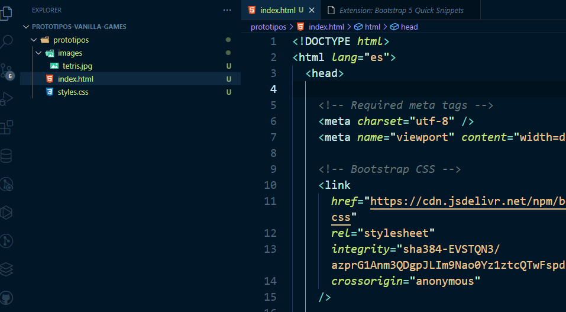

---

title: Hist5 - Entorno de desarrollo
tags:
  - wireframe
  - mockup
  - guía de estilos
position: 

---

“Dame seis horas para cortar un árbol y pasaré las primeras cuatro afilando el hacha.” – Abraham Lincoln

Si queremos ser eficientes en la creación de aplicaciones web, lo mejor es empezar por configurar bien nuestro entorno de desarrollo.
Para ello vamos a instalar/configurar las siguientes herramientas:
1. Un buen software para escribir nuestro código. En nuestro caso usaremmos el programa **VSCode** de Microsoft.
2. Instalación del software para el control de versiónes. Nosotros instalaremos **GIT**.
3. Una aplicación web para sincronizar nuestro repositorio en la nube. En nuestro caso será **GitHub**.

## 1. VSCode

Sin duda, en le momento de escribir esta documentación, el rey de los IDs es, sin duda, Visual Studio Code (VSCode).


:::note

**VSCode** es un programa muy útil para escribir código. Es como una navaja suiza para los desarrolladores. Te permite **editar y organizar tus archivos** de código de manera fácil y rápida. Además, tiene un montón de **extensiones** y herramientas fantásticas que te facilitan la vida, como **autocompletado**, **depuración** y **control de versiones**. En resumen, es como el mejor amigo de un programador, siempre dispuesto a ayudarte a escribir código de manera eficiente.

:::

Os hago un resumen de algunas aspectos que debes tener en cuenta a la hora de instalar y configurar VSCode, y te pondré información ampliada ya que es un tema muy trillado en internet:
### 1.1. Descarga e instala VSCode 
[Puedes encontrar la versión oficial de vscode aquí]([Descarga](https://code.visualstudio.com/Download))
### 1.2. Elige el tema que más te guste. 
Puedes tunear tu VSCode instalando diferentes temas. Para ello:

- Desde el buscador de extensiones (ctrl + mayus + X) escribe el nombre del tema que quieres instalar.
- Haz clic en instalar extensión.
- Desde el icono de configuración de vscode (la tuerquecita de abajo a la izquierda) selecciona '**Temas > Tema de color**'
- Selecciona el tema que has instalado y... ¡ya lo tienes!

:::tip 

En este enlace puedes encontrar algunos temas para instalar en tu VSCode: [Themes VSCode](https://vscodethemes.com/?type=dark)

Y aquí te dejo una tabla de algunos temas que nos recomienda el amigo 'Manz'
<details>
  <summary>Tabla de temas recomendados</summary>
  
  Estos son algunos de los temas que nos recomienda <a href="https://terminaldelinux.com/terminal/preparacion-entorno/instalar-vscode/">Manz</a>"


    🌈 Flatland Monokai
    👀 Enfocado Theme
    🟡 Bluloco Dark Theme
    🧔 Bearded Theme
    🐼 Panda Theme
    🟣 2077 Theme
    🧛‍♀️ Dracula Dark Theme
    💠 SynthWave 84
    🤍 GitHub Light Theme
    😸 Gatito Theme
    💚 Vue Theme
    ⚫ One Monokai Theme
    🌃 Palenight Theme
    👧 Doki Theme
    🗻 Monokai Theme
    🔵 Cobalt2 Theme
    🐺 Winter is Coming
</details>

:::

### 1.3. Instala un tema de iconos, por ejemplo [VSCode Icons](https://marketplace.visualstudio.com/items?itemName=vscode-icons-team.vscode-icons) o [Material Icon](https://marketplace.visualstudio.com/items?itemName=PKief.material-icon-theme)

Para instalar los iconos el proceso es el mismo:

  - Desde el buscador de extensiones escribe el nombre del tema de iconos
  - En configuración, selecciona '**Tema > Tema de icono de archivo**' y busca el tema instalado.
  - Ahora verás que en la columna de la izquierda, cada archivo tiene un icono diferente en función de su extensión: html, css, etc.

### 1.4. Extensiones

Con las extensiones puedes aumentar la potencia y mejorar tu flujo de trabajo. 

Una de las extensiones que te recomiendo sí o sí es '**Prettier**'. Esta extensión se va a encargar de formatear tu código HTML y CSS port tí, respetando las identaciones.
El proceso para instalar esta extensión es muy simple, solo tienes que buscar la extensión en el buscador y darle a instalar.

:::tip Cómo formatear automáticamente en VS Code para ahorrar tiempo y esfuerzo

Aquí tienes un artículo donde se explica como instalar y configurar Prettier para que el código se formatee cada vez que guardamos nuestro archivo:

<a href={"https://geekflare.com/es/auto-format-in-vs-code/"}>Cómo formatear automáticamente en VS Code para ahorrar tiempo y esfuerzo</a>

:::

Otra extensión imprescindible para nosotros es **Live Server**. Mediante esta extensión podremos tener un servidor virtual que mostrará el resultado de nuestro trabajo en un navegador, con la ventaja de que la vista se irá actualizando conforme vamos modificando el código.

Existen infinidad de extensiones para VSCode
Aquí puedes ver un ejemplo de mi entorno. Utilizo el tema **Night Owl** y los iconos de **VSCode Icons**.
Fijate que el código html está formateado con **Prettier**



De momento, con esto es suficiente para comenzar a trabajar en el desarrollo de los prototipos html y css. Más adelante acabaremos de configurar nuestro entorno para trabajar con NodeJS y otras herramientas que nos ayudarán a programar de forma más eficiente.

## 2. Control de versiones - Git

Para el control de versiones vamos a instalar y configurar Git. Aunque seguro que a estas alturas ya sabes qué es Git, pero deja que te refresque algunas ideas importantes:

:::tip 

👉 Git es como un superpoderoso **control de versiones para tu código**. Imagina que estás escribiendo un ensayo importante y cada vez que haces cambios guardas una nueva versión en diferentes archivos, como "ensayo_v1", "ensayo_v2" y así sucesivamente. Git hace algo similar pero para tu código.

👉 Con Git, puedes **guardar diferentes versiones de tu proyecto a medida que avanzas**. Esto significa que si cometes un error o quieres volver a una versión anterior, ¡es pan comido! Git te permite viajar en el tiempo y regresar a cualquier punto en la historia de tu proyecto.

👉 Pero eso no es todo. Git también es **excelente para trabajar en equipo**. Puedes colaborar con otros programadores sin pisar los pies de nadie. Cada persona puede trabajar en su propia versión del proyecto y luego combinar los cambios de todos de manera ordenada.

👉 Además, Git hace que **compartir tu código** sea súper fácil. Puedes subir tu proyecto a un repositorio en línea (como **GitHub** o GitLab) y otras personas pueden descargarlo y contribuir. Incluso puedes colaborar con desarrolladores de todo el mundo en proyectos de código abierto.

:::

Vamos a instalar (si aun no está instalado) Git. Para ello:  
1. Descarga su última versión de la web oficial: [Download Git](https://git-scm.com/).
2. Instala en tu ordenador el software.
3. Configura git para tu usuario:
  
   - Lo primero que deberás hacer cuando instales Git es establecer tu nombre de usuario y dirección de correo electrónico. Esto es importante porque los "commits" de Git usan esta información, y es introducida de manera inmutable en los commits que envías:

  ```
    $ git config --global user.name "John Doe"
    $ git config --global user.email johndoe@example.com  
  ```
Sólo necesitas hacer esto una vez si especificas la opción --global, ya que Git siempre usará esta información para todo lo que hagas en ese sistema

:::tip 
Tienes más información de cómo configurar Git aquí: [Configurando Git por primera vez](https://git-scm.com/book/es/v2/Inicio---Sobre-el-Control-de-Versiones-Configurando-Git-por-primera-vez)

