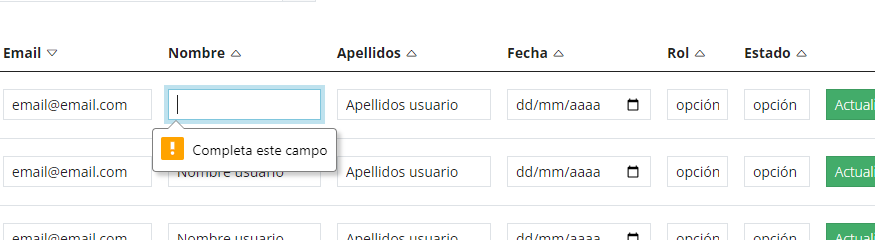

En HTML5, podemos realizar validaciones en formularios utilizando atributos y elementos específicos. Aquí tienes un resumen de cómo vamos a crear validaciones utilizando HTML5:

- Atributo **required**: Puedes usar el atributo required en campos de entrada para asegurarte de que el usuario complete ese campo antes de enviar el formulario.

```html
<input type="text" name="nombre" required>

```

- Atributo **pattern**: Puedes usar el atributo pattern junto con una expresión regular para validar el formato de entrada en un campo.

```html
<input type="text" name="telefono" pattern="[0-9]{10}" title="Ingresa un número de teléfono válido de 10 dígitos">
```

- Atributo **min y max**: Para campos numéricos, puedes utilizar los atributos min y max para establecer rangos válidos.

```html
<input type="number" name="edad" min="18" max="99">
```

- Atributo **email**: Puedes usar el atributo type="email" en un campo de entrada para asegurarte de que la entrada sea un formato de correo electrónico válido.

```html
<input type="email" name="correo">
```

- Atributo **url**: Similar al atributo email, el atributo type="url" valida que la entrada sea una URL válida.

```html
<input type="url" name="sitio_web">
```

- Elemento `<textarea>` con required: Al igual que con los campos de entrada, puedes usar el atributo required con el elemento `<textarea>` para asegurarte de que se ingrese texto.

```html
<textarea name="comentarios" required></textarea>
```

- Elemento **`<select>` con required**: Puedes usar el atributo required con el elemento *select* para asegurarte de que se seleccione una opción antes de enviar el formulario.

```html
<select name="pais" required>
  <option value="">Selecciona un país</option>
  <option value="mx">México</option>
  <option value="us">Estados Unidos</option>
</select>
```

## Definición de restricciones para nuestros formularios
Vamos a definir las validaciones para cada formulario y a continuación modificaremos el código para aplicarlas.

### Formulario de Registro
  - El nombre es obligatorio
  - El apellido es opcional
  - Los campos email y contraseña son requeridos. Nombre y apellidos opcional
  - El email debe ser tipo un email correcto
  - La contraseña debe ser de 6 dígitos o más

El código de este formulario sería algo así:

```html title="formulario registro"
<!-- Formulario de registro -->
  <form action="" class="form border shadow-sm p-3">
    
    <!-- Nombre -->
    <label for="nombre" class="form-label">Nombre:</label>
    <input required id="nombre" type="text" class="form-control" />
    
    <!-- Apellidos -->
    <label for="apellidos" class="form-label">Apellidos:</label>
    <input id="apellidos" type="text" class="form-control" />
    
    <!-- Email -->
    <label for="email" class="form-label">Email:</label>
    <input required id="email" type="email" class="form-control" />
    
    <!-- Contraseña -->
    <label for="pass" class="form-label mt-3">Contraseña:</label>
    <input required id="pass" type="password" min="6" class="form-control" />
    
    <!-- Botón enviar -->
    <input type="submit" class="btn btn-primary w-100 mt-3" value="Enviar" />
  </form>

```
### Formulario de inicio de sesión (Login)
  - Los campos email y contraseña son requeridos.
  - El email debe ser tipo un email correcto
  - La contraseña debe ser de 6 dígitos o más


```html title="Formulario de inicio de sesión"
<!-- Formulario de inicio de sesión (login) -->
  <form action="" class="form border shadow-sm p-3">
    <!-- Email -->
    <label for="email" class="form-label">Email:</label>
    <input required type="email" class="form-control" />

    <!-- Contraseña -->
    <label for="pass" class="form-label mt-3">Contraseña:</label>
    <input required id="pass" type="password" min="6" class="form-control" />

    <!-- Recordar contraseña -->
    <div class="form-check mt-3">
      <input
        class="form-check-input"
        type="checkbox"
        value=""
        id="flexCheckChecked"
        checked
      />
      <label class="form-check-label" for="flexCheckChecked">
        Recordar sesión
      </label>
    </div>

    <!-- Link a recordar contraseña -->
    <a class="d-block text-end" href="#">¿Has olvidado tu contraseña?</a>

    <!-- Botón Iniciar sesión -->
    <input
      type="submit"
      class="btn btn-primary w-100 mt-3"
      value="Iniciar sesión"
    />
  </form>
```

### Formulario para Editar perfil
  - El nombre es obligatorio
  - El apellido es opcional
  - Los campos email y contraseña son requeridos.
  - El email debe ser tipo un email correcto
  - La contraseña debe ser de 6 dígitos o más
  - La url de la imagen debe ser de tipo url correcta, y es opcional

```html title="Editar Perfil"
<!-- Formulario de edición de perfil -->
  <form action="">
    <div class="modal-dialog">
      <div class="modal-content">
        <div class="modal-header">
          <h1 class="modal-title fs-5" id="exampleModalLabel">
            Edición de perfil
          </h1>
          <button
            type="button"
            class="btn-close"
            data-bs-dismiss="modal"
            aria-label="Close"
          ></button>
        </div>
        <div class="modal-body">
          <div class="form border shadow-sm p-3">
            <div class="m-1" style="max-width: 400px">
              <div class="imgPerfil border shadow-sm p-3 mb-3">
                <div
                  class="imagen mx-auto mb-1 rounded-circle"
                  style="
                    background-image: url(./images/avatar.svg);
                    width: 200px;
                    height: 200px;
                    background-size: cover;
                    background-position: center;
                  "
                ></div>
                
                <!-- Imagen de perfil -->
                <label for="imagen" class="form-label mt-3">URL imagen:</label>
                <input
                  id="imagen"
                  type="url"
                  class="form-control"
                  value="http://imagenavatar.png"
                />
              </div>

              <div class="">
                
                <!-- Nombre -->
                <label for="nombre" class="form-label">Nombre:</label>
                <input required id="nombre" type="text" class="form-control" />
                
                <!-- Apellidos -->
                <label for="apellidos" class="form-label">Apellidos:</label>
                <input id="apellidos" type="text" class="form-control" />
                
                <!-- Email -->
                <label for="email" class="form-label">Email:</label>
                <input required id="email" type="email" class="form-control" />
                
                <!-- Contraseña -->
                <label for="pass" class="form-label mt-3">Contraseña:</label>
                <input required id="pass" type="password" min="6" class="form-control" />
              </div>
            </div>
          </div>
        </div>
        <div class="modal-footer">
          <button type="button" class="btn btn-secondary" data-bs-dismiss="modal">
            Cancelar
          </button>
          <button type="button" class="btn btn-primary">Guardar cambios</button>
        </div>
      </div>
    </div>
  </form>
```

### Formulario Nuevo proyecto / Editar proyecto 
- El nombre y estado son obligatorios
- La fecha debe ser de tipo fecha
- El enlace debe ser url correcta
- El repositorio debe ser url correcta
- La imagen debe ser url correcta


```html title="Formulario Nuevo proyecto"
<!-- Formulario nuevo proyecto -->
  <form action="" class="form">
    
    <!-- Nombre proyecto -->
    <label class="form-label" for="nombre"><strong>Nombre: </strong></label>
    <input required id="nombre" type="text" value="Nombre Autor" class="form-control" />
    
    <!-- Descripción -->
    <label class="form-label mt-2" for="descripcion"
      ><strong>Descripción: </strong></label
    >
    <textarea id="descripcion" class="form-control" rows="4">Lorem ipsum dolor sit amet consectetur adipisicing elit. Accusantium, sunt? Recusandae labore at voluptatem tempore incidunt distinctio eaque? Est aspernatur laudantium itaque ullam numquam autem dolor quia amet eum consectetur.</textarea>
    
    <!-- Estado -->
    <label class="form-label mt-2" for="estado"><strong>Estado: </strong></label>
    <select required id="estado" class="form-control">
      <option value="estado">estado</option>
      <option value="otro estado">otro estado</option>
    </select>

    <!-- Fecha -->
    <label class="form-label mt-2" for="fecha"><strong>Fecha: </strong></label>
    <input id="fecha" type="date" class="form-control" value="12/12/2023"/>

    <!-- Enlace al proyecto -->
    <label class="form-label mt-2" for="enlace"><strong>Enlace: </strong></label>
    <input id="enlace" type="url" class="form-control" value="http://enlace.com" />

    <!-- Repositorio -->
    <label class="form-label mt-2" for="repositorio"
      ><strong>Repositorio: </strong></label
    >
    <input id="repositorio" type="text" class="form-control" value="user.github.com/123456" />

    <!-- Submit -->
    <input type="submit" class="btn btn-success mt-3" value="Subir proyecto">
  </form>
```

```html title="Formulario editar proyecto"
<form action="" class="">
  <div class="row mt-2">
    <div class="col-12 col-md-4 pt-2 mb-3">
      
      <label class="form-label mt-2" for="urlImagen"
        ><strong>URL imagen: </strong></label
      >
      <input
        id="urlImagen"
        type="text"
        class="form-control"
        value="http://enlaceImagen.com"
      />
    </div>
    <div class="col-12 col-md-8">
      <!-- Formulario nuevo proyecto -->

      <!-- Nombre proyecto -->
      <label class="form-label" for="nombre"><strong>Nombre: </strong></label>
      <input
        required
        id="nombre"
        type="text"
        value="Nombre Autor"
        class="form-control"
      />

      <!-- Descripción -->
      <label class="form-label mt-2" for="descripcion"
        ><strong>Descripción: </strong></label
      >
      <textarea id="descripcion" class="form-control" rows="4">
        Lorem ipsum dolor sit amet consectetur adipisicing elit. Accusantium, sunt? Recusandae labore at voluptatem tempore incidunt distinctio eaque? Est aspernatur laudantium itaque ullam numquam autem dolor quia amet eum consectetur.</textarea
      >

      <!-- Estado -->
      <label class="form-label mt-2" for="estado"
        ><strong>Estado: </strong></label
      >
      <select required id="estado" class="form-control">
        <option value="estado">estado</option>
        <option value="otro estado">otro estado</option>
      </select>

      <!-- Fecha -->
      <label class="form-label mt-2" for="fecha"
        ><strong>Fecha: </strong></label
      >
      <input id="fecha" type="date" class="form-control" value="12/12/2023" />

      <!-- Enlace al proyecto -->
      <label class="form-label mt-2" for="enlace"
        ><strong>Enlace: </strong></label
      >
      <input
        id="enlace"
        type="url"
        class="form-control"
        value="http://enlace.com"
      />

      <!-- Repositorio -->
      <label class="form-label mt-2" for="repositorio"
        ><strong>Repositorio: </strong></label
      >
      <input
        id="repositorio"
        type="text"
        class="form-control"
        value="user.github.com/123456"
      />

      <!-- Submit -->
      <input
        type="submit"
        class="btn btn-success mt-3"
        value="Subir proyecto"
      />
    </div>
  </div>
</form>
```

### Formulario Editar usuarios desde Admin

  - El nombre es obligatorio
  - El apellido es opcional
  - Los campos email y contraseña son requeridos.
  - El email debe ser tipo un email correcto
  - La contraseña debe ser de 6 dígitos o más
  - La url de la imagen debe ser de tipo url correcta, y es opcional

```html title="Formulario editar usuario desde admin"

<form action="">
  <td>
    <div class="containerImagen">
      <div
        class="rounded-circle d-flex align-items-end justify-content-end"
        style="
          background-image: url(./images/avatar.svg);
          width: 50px;
          height: 50px;
          background-size: cover;
          background-position: center;
        "
      >
        <i class="btn btn-success btn-sm rounded-circle bi bi-pencil"></i>
      </div>
    </div>
  </td>
  <td>
    <!-- URL imagen -->
    <input
      type="url"
      class="form-control form-control-sm"
      value="http://imagen.com"
    />
  </td>
  <td>
    <!-- email -->
    <input
      required
      type="email"
      class="form-control form-control-sm"
      value="email@email.com"
    />
  </td>
  <td>
    <input
      required
      type="text"
      class="form-control form-control-sm"
      value="Nombre usuario"
    />
  </td>
  <td>
    <input
      type="text"
      class="form-control form-control-sm"
      value="Apellidos usuario"
    />
  </td>

  <td>
    <input
      type="date"
      class="form-control form-control-sm"
      value="12/12/2023 proyecto"
    />
  </td>
  <td>
    <select class="form-control form-control-sm" name="" id="">
      <option value="1">opción</option>
      <option value="2">opción2</option>
    </select>
  </td>
  <td>
    <select class="form-control form-control-sm" name="" id="">
      <option value="1">opción</option>
      <option value="2">opción2</option>
    </select>
  </td>
  <td>
    <button type="submit" class="btn btn-sm btn-success">
      Actualizar
    </button>
  </td>
  <td><i class="btn btn-sm btn-outline-danger bi bi-trash3"></i></td>
</form>
```

Estas serían todas las validaciones utilizando las caracteristicas de html5. 

La respuesta del navegador cuando intentamos enviar un formulario con campos que no cumplen su condición establecida **difiere dependiendo del navegador**. 

*Ejemplo de visualización de un formulario que no valida utilizando Google Chrome*


Para evitar este problema podemos utilizar el **sistema de validación que nos ofrece Bootstrap.** Este sistema de validación implica **utilizar algo de javascript**, tal y como veremos en la siguiente tarea.