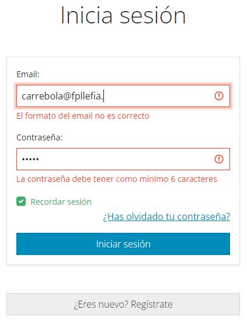

En el apartado anterior hemos definido las reglas de validación de nuestros formularios y hemos aplicado las restricciones utilizando propiedades de html5 en los diferentes campos.

Este sistema, aunque muy útil, presenta un problema: no todos los navegadores muestran los mensajes de validación de la misma manera, y esto a veces puede interferir en el funcionamiento de nuestra aplicación.

Para evitar este inconveniente vamos a utilizar el sistema de validación de Bootstrap que, aunque no es perfecto (presenta algunos problemas de accesibilidad), mejorará el aspecto y control de los mensajes cuando el navegador nos informe de errores.

:::info Validación con Bootstrap
Puedes aprender más sobre la validación con Bootstrap aquí:

👉 [https://getbootstrap.esdocu.com/docs/5.1/forms/validation/](https://getbootstrap.esdocu.com/docs/5.1/forms/validation/)

:::

## ¿Cómo funciona? Formulario de inicio de sesión
Para mostrar como funciona vamos a utilizar el formulario de inicio de sesión. Te muestro el código tal y como está ahora:

```html title="form inicio sesión"
<!-- Formulario de inicio de sesión (login) -->
<form action="" class="form border shadow-sm p-3">
  <!-- Email -->
  <label for="email" class="form-label">Email:</label>
  <input required type="email" class="form-control" />

  <!-- Contraseña -->
  <label for="pass" class="form-label mt-3">Contraseña:</label>
  <input required minlength="6" id="pass" type="password" class="form-control" />

  <!-- Recordar contraseña -->
  <div class="form-check mt-3">
    <input
      class="form-check-input"
      type="checkbox"
      value=""
      id="flexCheckChecked"
      checked
    />
    <label class="form-check-label" for="flexCheckChecked">
      Recordar sesión
    </label>
  </div>

  <!-- Link a recordar contraseña -->
  <a class="d-block text-end" href="#">¿Has olvidado tu contraseña?</a>

  <!-- Botón Iniciar sesión -->
  <input
    type="submit"
    class="btn btn-primary w-100 mt-3"
    value="Iniciar sesión"
  />
</form>

```

1. En primer lugar necesitamos deshabilitar la validación de html5. Para ello añadiremos a la etiqueta `<form>` el atributo `novalidate`
   
   ```html
   <form novalidate action="" class="form border shadow-sm p-3">
   ```

2. Vamos ahora a añadir los mensajes de error que se mostrarán cuando un campo no valide correctamente. En este formulario el email debe tener un formato correcto y la contraseña debe tener un mínimo de 6 caracteres, y lógicamente, los campos no pueden estar vacíos.
   
```html
  <!-- Email -->
  <label for="email" class="form-label">Email:</label>
  <input required type="email" class="form-control" />
  <div class="invalid-feedback">
    El formato del email no es correcto
  </div>
  <!-- Contraseña -->
  <label for="pass" class="form-label mt-3">Contraseña:</label>
  <input required minlength="6" id="pass" type="password" class="form-control" />
  <div class="invalid-feedback">
      La contraseña debe tener como mínimo 6 caracteres
  </div>

```
:::tip
También podemos añadir mensajes que se mostrarán **si el campo valida correctamente** usando la clase `valid-feedback`, pero nosotros no los vamos a necesitar.
:::

Ahora lo que haremos, mediante javascript, será: 
1. Capturar el formulario en una variable
2. detectar cuando se intenta enviar el formulario (escuchando el evento submit)
3. Comprobar si el formulario valida correctamente. Si no valida
   1. Detenemos el evento submit para que no se intente enviar el formulario
   2. Y añadimos la clase no validate al formulario. Esto hará que se muestren los mensajes de error.

Este sería el código js resultante. Recuerda que debes incluirlo al final de la página, antes de de cerrar el body, mediante una etiqueta `<script>`

:::danger ¡Recuerda!
No te olvides del commit 😉
:::

```html title="login.html"
<!-- Script para la validación del formulario -->
<script>
  //Capturamos el formulario en una variable
  const formulario = document.querySelector("form")
  //Detectamos su evento submit (enviar)
  formulario.addEventListener("submit", (event) => {
    //Comprobamos si el formulario no valida 
    if (!formulario.checkValidity()) {
      //Detenemos el evento enviar (submit)
      event.preventDefault()
      event.stopPropagation()
    }
    //Y añadimos la clase 'was-validate' para que se muestren los mensajes
    formulario.classList.add('was-validated')
  });
</script>
```
Aquí puedes ver como se mostraría un error de validación usando este método:



Ahora solo nos faltaría aplicar este mísmo método a todos los formularios de nuestros prototipos html 😅. ¡Adelante!
