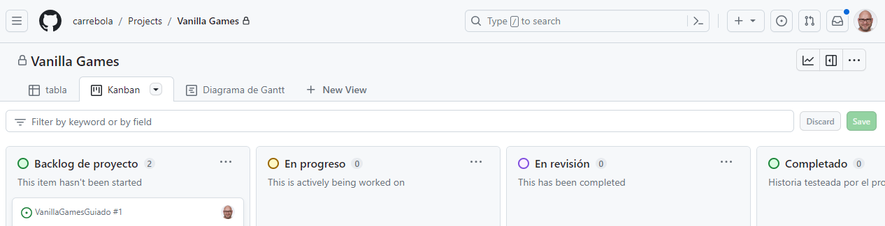
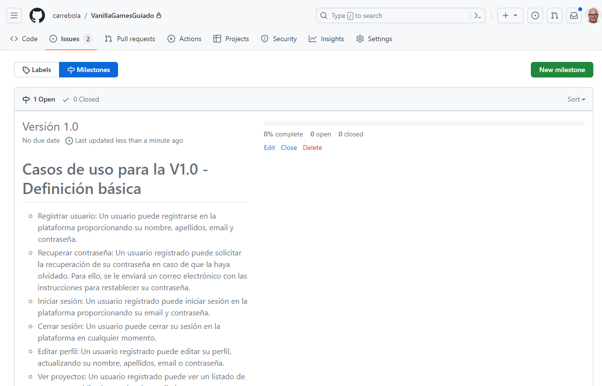
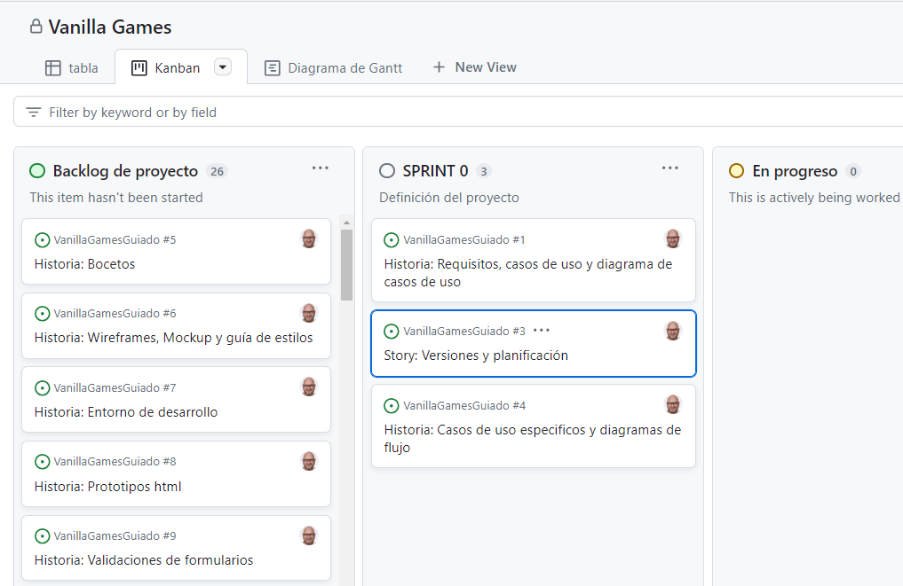

# Github Projects

Vamos a planificar nuestro proyecto utilizando GitHub Projects

Características de GitHub Projects

Los proyectos son una característica de GitHub que te permite organizar y hacer un seguimiento del trabajo en tu repositorio. Los proyectos son especialmente útiles para la gestión de tareas y la colaboración en equipos de desarrollo. Aquí hay algunas características clave de los proyectos en GitHub:
- Tableros personalizables: Los proyectos en GitHub se basan en tableros personalizables que te permiten organizar tareas en columnas. Puedes crear columnas para representar diferentes etapas del trabajo, como "Por hacer," "En progreso" y "Completado."

- Tarjetas: Cada tarea se representa como una tarjeta en el tablero del proyecto. Las tarjetas pueden contener detalles, comentarios, etiquetas y asignaciones para indicar quién está trabajando en la tarea.

- Asignación de tarjetas: Puedes asignar tarjetas a miembros específicos de tu equipo para indicar quién está a cargo de una tarea en particular.

- Etiquetas: Puedes etiquetar tarjetas con etiquetas personalizadas para categorizar tareas por tipo, prioridad o cualquier otro criterio que desees.

- Automatizaciones: Puedes configurar reglas de automatización para mover tarjetas automáticamente de una columna a otra cuando se cumplen ciertas condiciones, lo que facilita el seguimiento del progreso del trabajo.

- Seguimiento visual: Los proyectos ofrecen una vista visual que te permite ver de un vistazo en qué etapa se encuentra cada tarea y cómo se relacionan entre sí.

- Notificaciones: GitHub te notificará sobre actividades relacionadas con las tarjetas del proyecto, como comentarios, asignaciones o cambios de estado.

- Enlaces con pull requests y issues: Puedes vincular tarjetas de proyecto con pull requests y problemas (issues) para un seguimiento más preciso del trabajo relacionado con el código.
  

### Pasos para gestionar nuestro proyecto con GitHub Projects

Vamos a crear toda la infraestructura para la gestión de nuestro proyecto. En primer lugar crearemos un repositorio para, a continuación, vincularlo con un proyecto de GitHub.

#### Paso 1: Crear un Repositorio en GitHub

Crea un repositorio siguiendo estos pasos:

1. Inicia sesión en tu cuenta de GitHub.
2. Haz clic en el botón "New" en la esquina superior derecha de la página de inicio de GitHub.
3. Completa los detalles del repositorio, como el nombre (Vanilla Games), la descripción y la visibilidad (privado).
4. Marca la casilla "Initialize this repository with a README" para incluir un archivo README.md inicial.
5. Haz clic en "Create repository" para crear el repositorio.

#### Paso 2: Crear un Proyecto en GitHub

Un proyecto en GitHub te permite organizar las historias de usuario y issues. Sigue estos pasos para crear un proyecto:

1. En la página principal de tu repositorio, ve a la pestaña "Projects".
2. Haz clic en "New project" para crear un nuevo proyecto.
3. Dale un nombre al proyecto, como "Proyecto Vanilla Games".

#### Paso 3: Agregar Columnas al Proyecto

Vamos a crear las vistas para nuestro proyecto
1. Dentro del proyecto, vamos a crear tres vistas, una de tipo tabla, otra para los tableros kanban y otra para el diagrama de Gantt.
2. En la vista kanban vamos crear columnas para organizar las historias de usuario y issues. Utilizaremos los siguientes tableros: "Backlog", "En Pro Progreso", "En Revisión" y "Completado". Para agregar columnas:

- Haz clic en el botón "Add column" debajo del título del proyecto.
- Crea las columnas que necesitas, como "Backlog de proyecto", "En Progreso", "En Revisión" y "Completado".

#### Paso 4: Crear Historias de Usuario y Issues

Ahora, crea las historias para el proyecto. 
1. Abre la vista tabla y añade las historias (nombre y descripción).
2. Convierte las historias en issues para poder hacer seguimiento tanto desde el repositorio como desde proyectos y asignalas al proyecto correspondiente.
3. Asigna el issue a los miembros del equipo responsables de su implementación.

#### Paso 5: Etiquetas para categorizar las historias e Issues

Por el momento vamos a crear etiquetas para categorizar las historias en sprints. Para ello:
1. Entra en el repositorio
2. Selecciona '`Issues`'
3. Haz click en '`Labels`'
4. Borra todas las etiquetas y crea las que, por el momento, vamos a utilizar
   1. Documentación
   2. Sprint 1
   3. Sprint 2
   4. Sprint 3
   5. Sprint 4
   6. Sprint 5

##### Paso 6: Utilizar Milestones para las versiones

Vamos a agrupar un conjunto de issues o historias de usuario relacionadas en un objetivo específico o versión, puedes utilizar "milestones". Para crear un milestone:

1. Navega a la pestaña "Issues" en tu repositorio.
2. Haz clic en "Milestones" y luego en "New milestone.
3. Dale un nombre al milestone, como "**Versión 1.0**".
4. Podemos añadir en la descripción los casos de uso para esta versión. De momento no vamos a asignar la fecha de vencimiento.
5. Para acabar, vamos a agregar los issues o historias de usuario relacionados a ese milestone.

#### Paso 7: Agregando etiquetas y milstone
Desde la vista de tabla, añade las columnas necesarias para visualizar las etiquetas y milstone que tienen asociada cada historia.

#### Paso 8: Columna para sprint

Vamos a crear ahora una nueva columna para el sprint actual, y movemos las historias desde el backlog de producto al sprint correspondiente.

