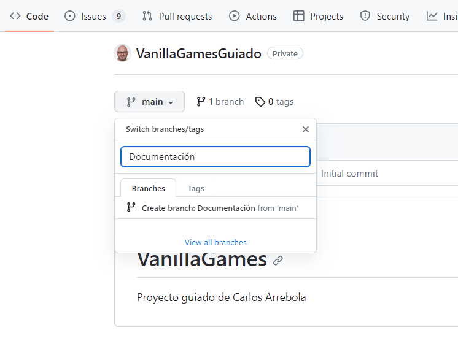
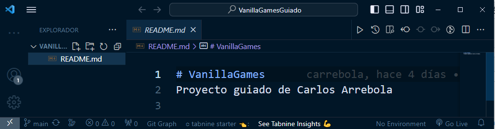
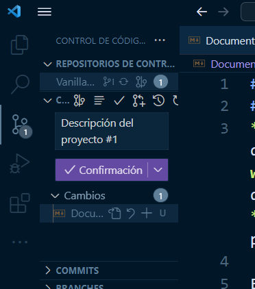

---

title: Documentación
tags:
  - Documentación

---

# Documentación en repositorio
Ya tenemos nuestro proyecto planificado en un primer nivel.

Las tres primeras versiones hacen referencia a definición de los requisitos, casos de uso y versiones así como a la planificación.

Vamos a dar un paso atrás para recuperar la documentación generada en estas historias y almacenarla en el repositorio.

Para ello, vamos a comenzar creando una nueva rama en nuestro repositorio:

Ahora abrimos el repositorio con VSCode para trabajar de manera más cómoda. Para ello:

- Abrimos una ventana de VSCode
- Hacemos click en `clonar repositorio` y copiamos en la ventana superior la url del repositorio de '**VanillaGames**' y hacemos click en 'Clonar repositorio'
- Indicamos donde queremos que aparezca la carpeta de nuestro proyecto (en mi caso en el escritorio)

Observa como podemos ver en la columna izquierda la raiz del proyecto con el archivo **README.md**.

Si te fijas, podrás ver en la parte inferior izquierda, el nombre de la rama actual ('**main**'). Haz click sobre el nombre de la rama y selecciona la rama '**Documentación**' que acabamos de crear.

### Documentando el proyecto en el repositorio

Vamos a comenzar a subir archivos a nuestro repositorio. En nuestro caso utilizaremos archivos con extensión *md* para poder usar **Markup**. De esta manera podremos visualizar toda la información desde el mismo GitHub.

1. Asegurate que estás en la rama '**Documentación**'
2. Crea un archivo con nombre `DOCUMENTACION.md`
3. Copia la documentación que hemos generado hasta ahora (la encontrarás en el apartado '**Definiendo Vanilla Games**' ) 

Ahora, para subir los cambios en el repositorio, solo tienes que hacer click en el tercer icono de vscode (verás que tiene un **1** indicando que hay cambios en un archivo) y añadir un mensaje para el **commit**.

:::info Antes de hacer el commit...

Para asociar el commit con la historia (y el issue) de nuestro proyecto debemos añadir al mensaje del commit el numero de issue con un #. El mensaje quedaria así:

'**Descripción del proyecto #1**'

:::

Después de hacer el commit te preguntará si quieres hacer 'push'. Haz click en el bóton para hacerlo.

Si vas ahora a GitHub y seleccionas la rama podrás ver los cambios.

Abre los Issues del repositorio y podrás ver en el primer Issue con #1 como aparece información referente a este último push

:::danger Tarea

Amplia la documentación que hemos generado en la historia '**Requisitos y diagrama de casos de uso**' para la versión 1.

Deberías poder ver la información actualizada desde GitHub:

:::

:::info Antes de hacer el commit...

Para asociar el commit con la historia (y el issue) de nuestro proyecto debemos añadir al mensaje del commit el número de issue con un #. El mensaje podría ser algo así:

'**Crear Documentación: Requisitos y diagramas de uso completados #2**'

:::

