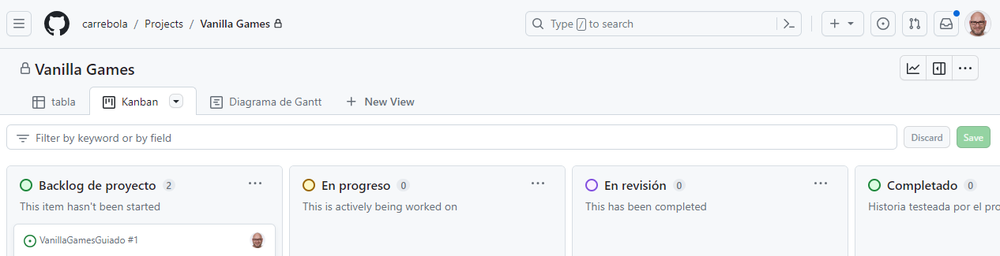
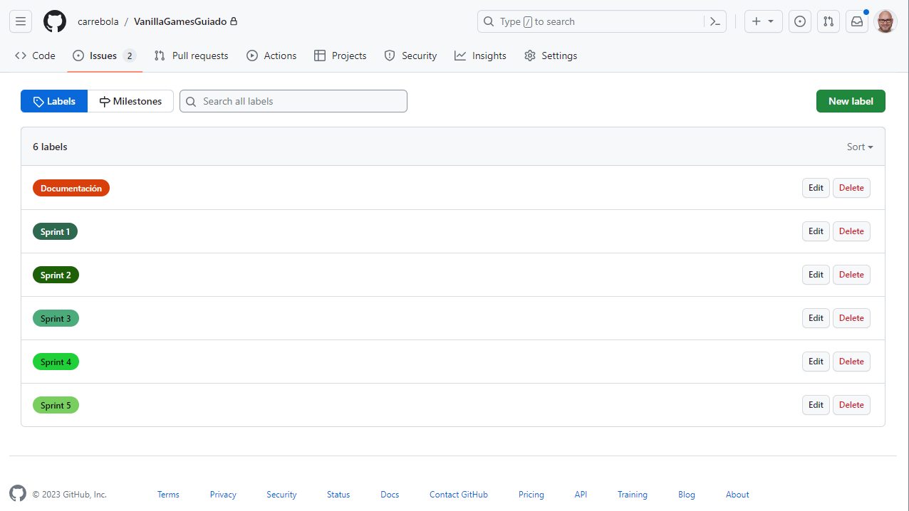
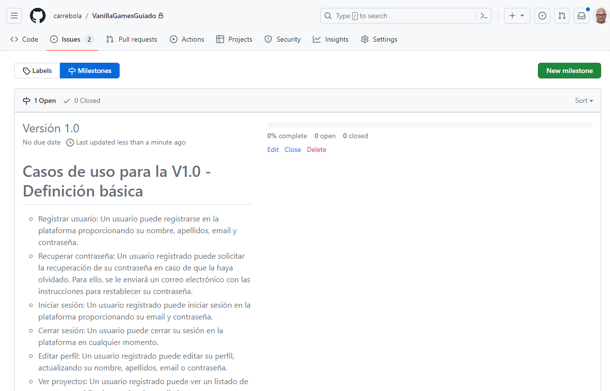
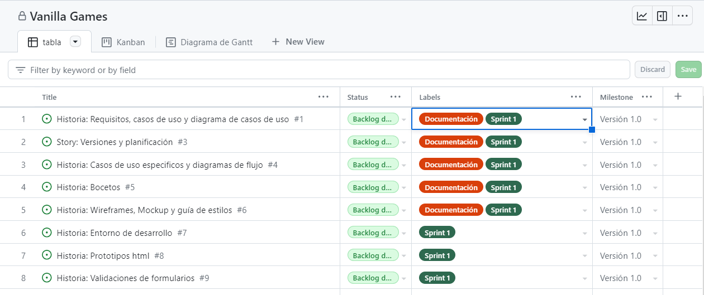
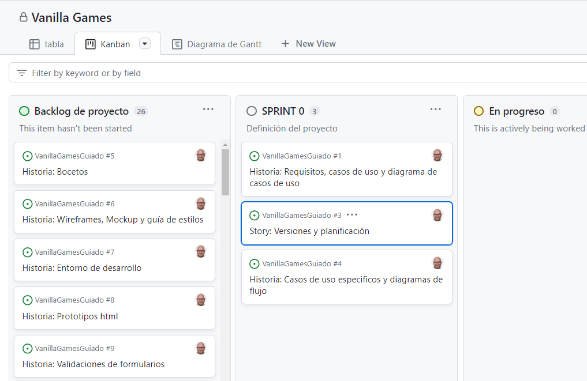
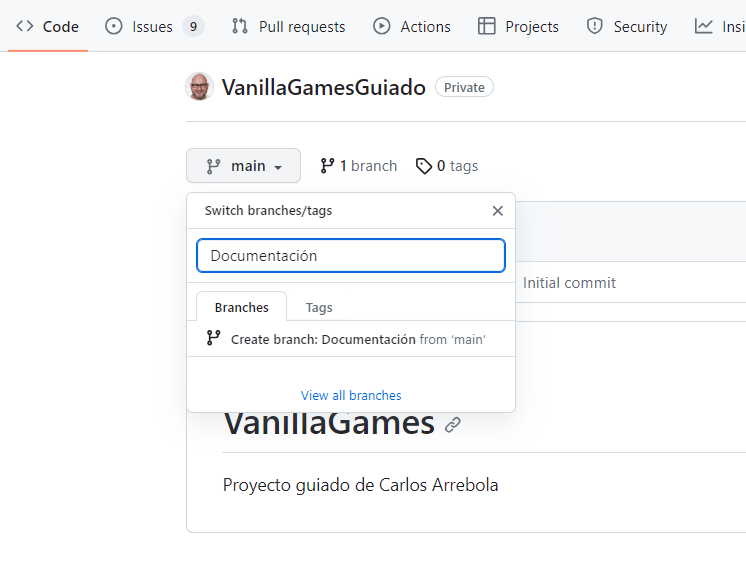
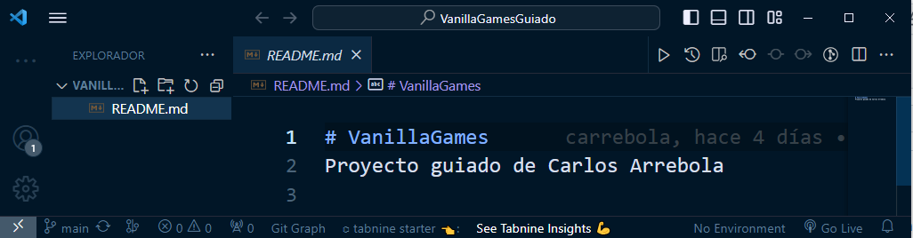
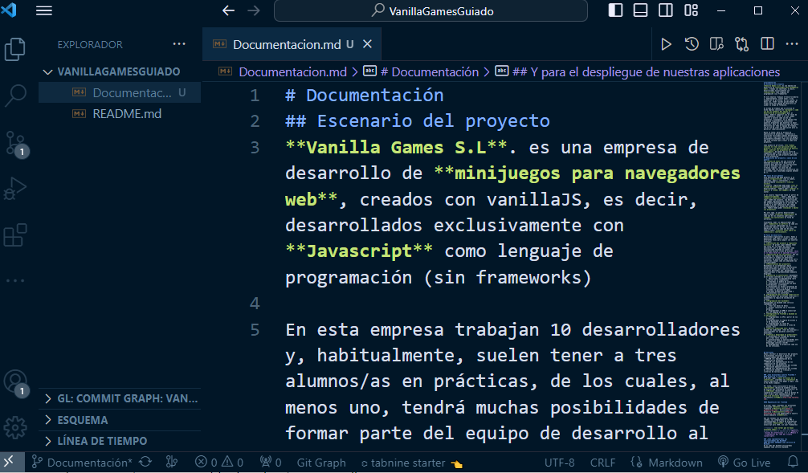
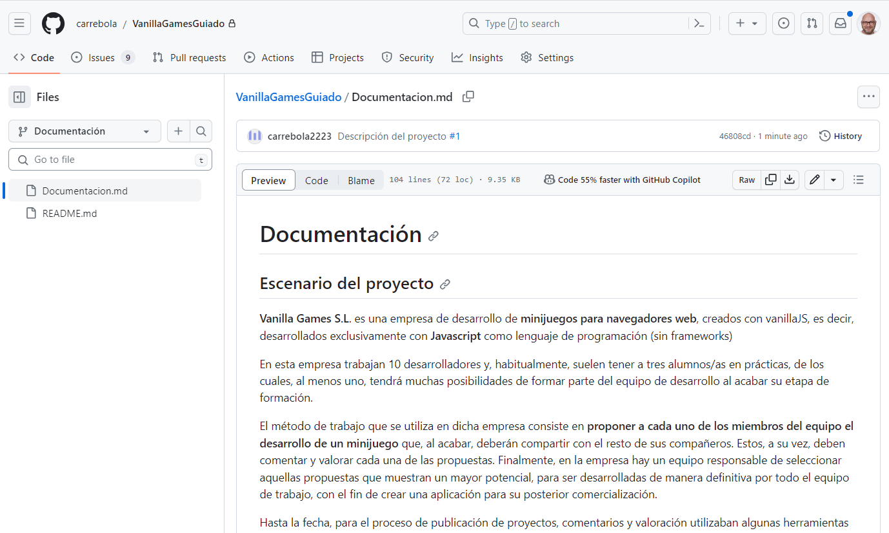
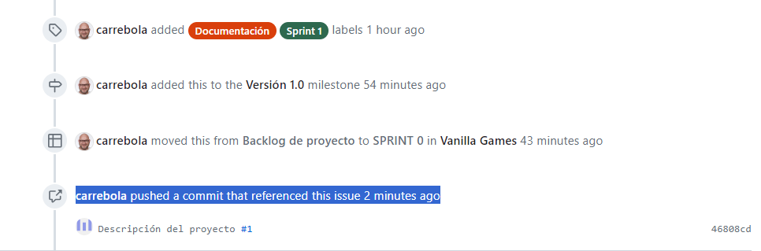

---

title: Hist1 - PLANIFICACIÓN DEL PROYECTO 
tags:
  - Requisitos
position: 10

---

## Planificación del proyecto

¡Estamos listos y hemos comenzado a desarrollar la **versión 1.0** de nuestro proyecto!

En el apartado anterior hemos definido qué funcionalidades debe tener. Además, hemos analizado las diferentes arquitecturas y tecnologías y hemos optado por utilizar una CSR (Client Side Rendering basada en una SPA programada en Javascript y conectada a Supabase como servicio backend).

Por lo tanto estamos en condiciones de definir cada una de las tareas que necesitaremos realizar para llevar a cabo esta primera versión del proyecto.

Para poder planificar el trabajo, vamos a crear el '**backlog de proyecto**', es decir, vamos a desglosar el trabajo en **historias** para, a continuación,  crear el **backlog de sprint** (donde agruparemos las historias por entregas). Finalmente vamos a  **planificar su temporización**, es decir, vamos a asignar un tiempo determinado a cada historia.

:::info 

  
¿Qué es el backlog de producto?

  

**El Backlog de producto** (Product Backlog en inglés) es una herramienta clave en la metodología Scrum, utilizada para gestionar el trabajo a realizar en un proyecto de software o desarrollo de producto. 

El backlog de producto es **una lista ordenada de todas las funcionalidades, características, requisitos y mejoras** que deben ser desarrollados en el producto para cumplir con los objetivos del proyecto.

El backlog de producto es creado por el **Product Owner** (dueño del producto) en colaboración con el equipo de desarrollo. El Product Owner es responsable de priorizar el backlog de producto y asegurar que las funcionalidades más importantes y valiosas sean entregadas primero. **El equipo de desarrollo utiliza el backlog de producto para planificar y estimar el trabajo a realizar en cada iteración (sprint) del proyecto.**

El backlog de producto es una **herramienta valiosa para el desarrollo ágil de software**, ya que ayuda a mantener el enfoque en el valor que se está entregando al usuario final, **asegura que el equipo de desarrollo esté trabajando en las funcionalidades más importantes y permite una planificación más precisa de las iteraciones del proyecto.**

:::
### Backlog de producto y de sprint. 
Estas serían las historias a planificar en la entrega de la versión 1 de nuestro proyecto agrupadas por sprints:

#### SPRINT 0: Definición del proyecto
- **Historia: Requisitos, casos de uso y diagrama de casos de uso**
  Como desarrollador, quiero definir de manera genérica las especificaciones de la aplicación.
- **Historia: Versiones y planificación**
  Como desarrollador, quiero agrupar las especificaciones en versiones, definir las tareas necesarias y realizar la planificación de todo el proceso de desarrollo del proyecto.
- **Historia: Casos de uso especificos y diagramas de flujo**
  Como desarrollador quiero definir las especificaciones y casos de uso para la versión 1.0.

  *(Esta historia ya hemos comenzado a trabajarla en apartados anteriores. No obstante, es importante que quede constancia de ello para poder hacer una valoración del tiempo total invertido.)*
#### SPRINT 1: Diseño de la interficie
- **Historia: Bocetos:**
  Como diseñador quiero dibujar los bocetos de todas las posibles pantallas del proyecto y testear su funcionamiento.
- **Historia: Wireframes, Mockup y guía de estilos:**
  Como diseñador quiero dibujar los mockups y crear la guía de estilos a partir de los colores, tipografías, etc seleccionadas.

#### SPRINT 2: Prototipos
- **Historia: Entorno de desarrollo:**
  Como diseñador/programador quiero instalar y configurar las herramientas necesarias para programar la aplicación, trabajar con repositorios y crear un entorno integración continua y despliegue continuo.
- **Historia: Prototipos html:**
  Como maquetador web quiero crear las páginas html del proyecto a partir de los wireframes aplicando la guía de estilos y utilizando Bootstrap 5.
- **Historia: Validaciones de formularios:**
  Como programador quiero definir e implementar las validaciones de los formularios del proyecto
 
#### Sprint 3: Implementación de la SPA
- **Historia: Entorno de desarrollo basado en NodeJS:**
  Como programador quiero instalar y configurar todas las herramientas necesarias (NodeJS, Vite, etc.) para el desarrollo de una app tipo SPA basada en Javascript 
- **Historia: Creación de proyecto basado en SPA y organización de archivos para las vistas basadas en módulos js:**
  Como programador quiero configurar el sistema de carpetas para las vistas y crear los archivos a partir de componentes html basados en los prototipos.
- **Historia: Creación de componentes:**
  Como programador quiero crear los componentes para el encabezado, el enrutado de las páginas y los menús.
- **Historia: Diseño del aspecto de las vistas:**
  Como usuario quiero poder navegar por todas las vistas de la aplicación (independientemente del del rol).
- **Historia: Implementación de la lógica para la validación de los formularios:**
  Como usuario quiero recibir feedback de validación en las vistas con formularios.
- **Historia: Lógica para la autenticación de usuarios:**
  Como usuario registrado quiero poder recordar los datos de sesión al loguearme (Uso de localStorage)
- **Historia: Actualización de componentes header y menús en función del rol de usuario logueado:**
Como usuario logueado quiero poder navegar por las vistas de la aplicación. (Podrán verse solo las opciones que corresponden a mi rol).
- **Historia: Diseño de las vistas a partir de los datos de un archivo JSON:**
  Como programador quiero simular el registro, login y visualización de las tablas de usuarios y proyectos a partir de datos ficticios obtenidos de una archivo json de prueba.
- **Historia: Lógica para la administración de usuarios y proyectos (ver, editar, borrar, etc.):**
  Como administrador quiero poder gestionar los usuarios y proyectos (CRUD)

#### Sprint 4: Backend

- **Historia: Diseño de la base de datos:**
  Como programador quiero diseñar la base de datos en base a diagrama UML (diagrama entidad-relación)

- **Historia: Implementación de las tablas y funciones en supabase:**
  Como programador quiero implementar las bases de datos en Supabase, diseñar las consultas e implementar las funciones postgree multitabla

- **Historia: API javascript de Supabase:**
  Como programador quiero probar las apis de javascript para el acceso a la base de datos

- **Historia: Implementación de un ORM para mapping de la base de datos:**
  Como programador quiero diseñar el diagrama de clases e implementarlo en javascript para tener un mapping de la bd.

#### Sprint 5: Integración del frontend y el backend

- **Historia: Login y registro:**
  Como usuario quiero poder registrarme e iniciar sesión.

- **Historia: Gestión de sesiones:**
  Como usuario registrado quiero ver la web en base al rol que tengo asignado.

- **Historia: Editar perfil**
  Como usuario registrado quiero poder ver y modificar mi perfil.

- **Historia: Gestión de Proyectos (Vista proyectos, detalle proyecto, etc):**
  Como usuario registrado 'desarrollador' quiero poder ver los proyectos, ver mis proyectos, crear proyectos, ver detalle de los proyectos y editar y borrar mis proyectos.

- **Historia: Gestión de usuarios:**
  Como usuario registrado 'administrador' quiero poder ver, editar y borrar los usuarios del sistema.
#### Sprint 6: Revisión y despliegue en producción de la versión 1.0

- **Historia: Test de usuarios**
  Como diseñador quiero realizar tests de usuarios a un grupo de usuarios focales.

- **Historia: Revisión de la aplicación**
  Como programador quiero revisar y corregir los posibles problemas detectados en el test de usuarios.

- **Historia: Despliegue en producción (RAILWAY)**
  Como programador quiero despleguar la aplicación en producción.

## Github Projects

Vamos a planificar nuestro proyecto utilizando GitHub Projects

Características de GitHub Projects

Los proyectos son una característica de GitHub que te permite organizar y hacer un seguimiento del trabajo en tu repositorio. Los proyectos son especialmente útiles para la gestión de tareas y la colaboración en equipos de desarrollo. Aquí hay algunas características clave de los proyectos en GitHub:
- Tableros personalizables: Los proyectos en GitHub se basan en tableros personalizables que te permiten organizar tareas en columnas. Puedes crear columnas para representar diferentes etapas del trabajo, como "Por hacer," "En progreso" y "Completado."

- Tarjetas: Cada tarea se representa como una tarjeta en el tablero del proyecto. Las tarjetas pueden contener detalles, comentarios, etiquetas y asignaciones para indicar quién está trabajando en la tarea.

- Asignación de tarjetas: Puedes asignar tarjetas a miembros específicos de tu equipo para indicar quién está a cargo de una tarea en particular.

- Etiquetas: Puedes etiquetar tarjetas con etiquetas personalizadas para categorizar tareas por tipo, prioridad o cualquier otro criterio que desees.

- Automatizaciones: Puedes configurar reglas de automatización para mover tarjetas automáticamente de una columna a otra cuando se cumplen ciertas condiciones, lo que facilita el seguimiento del progreso del trabajo.

- Seguimiento visual: Los proyectos ofrecen una vista visual que te permite ver de un vistazo en qué etapa se encuentra cada tarea y cómo se relacionan entre sí.

- Notificaciones: GitHub te notificará sobre actividades relacionadas con las tarjetas del proyecto, como comentarios, asignaciones o cambios de estado.

- Enlaces con pull requests y issues: Puedes vincular tarjetas de proyecto con pull requests y problemas (issues) para un seguimiento más preciso del trabajo relacionado con el código.
  

### Pasos para gestionar nuestro proyecto con GitHub Projects

Vamos a crear toda la infraestructura para la gestión de nuestro proyecto. En primer lugar crearemos un repositorio para, a continuación, vincularlo con un proyecto de GitHub.

#### Paso 1: Crear un Repositorio en GitHub

Crea un repositorio siguiendo estos pasos:

1. Inicia sesión en tu cuenta de GitHub.
2. Haz clic en el botón "New" en la esquina superior derecha de la página de inicio de GitHub.
3. Completa los detalles del repositorio, como el nombre (Vanilla Games), la descripción y la visibilidad (privado).
4. Marca la casilla "Initialize this repository with a README" para incluir un archivo README.md inicial.
5. Haz clic en "Create repository" para crear el repositorio.

#### Paso 2: Crear un Proyecto en GitHub

Un proyecto en GitHub te permite organizar las historias de usuario y issues. Sigue estos pasos para crear un proyecto:

1. En la página principal de tu repositorio, ve a la pestaña "Projects".
2. Haz clic en "New project" para crear un nuevo proyecto.
3. Dale un nombre al proyecto, como "Proyecto Vanilla Games".

#### Paso 3: Agregar Columnas al Proyecto

Vamos a crear las vistas para nuestro proyecto
1. Dentro del proyecto, vamos a crear tres vistas, una de tipo tabla, otra para los tableros kanban y otra para el diagrama de Gantt.
2. En la vista kanban vamos crear columnas para organizar las historias de usuario y issues. Utilizaremos los siguientes tableros: "Backlog", "En Pro Progreso", "En Revisión" y "Completado". Para agregar columnas:

- Haz clic en el botón "Add column" debajo del título del proyecto.
- Crea las columnas que necesitas, como "Backlog de proyecto", "En Progreso", "En Revisión" y "Completado".

#### Paso 4: Crear Historias de Usuario y Issues

Ahora, crea las historias para el proyecto. 
1. Abre la vista tabla y añade las historias (nombre y descripción).
2. Convierte las historias en issues para poder hacer seguimiento tanto desde el repositorio como desde proyectos y asignalas al proyecto correspondiente.
3. Asigna el issue a los miembros del equipo responsables de su implementación.

#### Paso 5: Etiquetas para categorizar las historias e Issues

Por el momento vamos a crear etiquetas para categorizar las historias en sprints. Para ello:
1. Entra en el repositorio
2. Selecciona '`Issues`'
3. Haz click en '`Labels`'
4. Borra todas las etiquetas y crea las que, por el momento, vamos a utilizar
   1. Documentación
   2. Sprint 1
   3. Sprint 2
   4. Sprint 3
   5. Sprint 4
   6. Sprint 5

##### Paso 6: Utilizar Milestones para las versiones

Vamos a agrupar un conjunto de issues o historias de usuario relacionadas en un objetivo específico o versión, puedes utilizar "milestones". Para crear un milestone:

1. Navega a la pestaña "Issues" en tu repositorio.
2. Haz clic en "Milestones" y luego en "New milestone.
3. Dale un nombre al milestone, como "**Versión 1.0**".
4. Podemos añadir en la descripción los casos de uso para esta versión. De momento no vamos a asignar la fecha de vencimiento.
5. Para acabar, vamos a agregar los issues o historias de usuario relacionados a ese milestone.

#### Paso 7: Agregando etiquetas y milstone
Desde la vista de tabla, añade las columnas necesarias para visualizar las etiquetas y milstone que tienen asociada cada historia.

#### Paso 8: Columna para sprint

Vamos a crear ahora una nueva columna para el sprint actual, y movemos las historias desde el backlog de producto al sprint correspondiente.

## Documentación en repositorio
Vamos a comenzar creando una rama en nuestro repositorio para la documentación:

Ahora abrimos el repositorio con VSCode para trabajar de manera más cómoda. Para ello:

- Abrimos una ventana de VSCode
- Hacemos click en `clonar repositorio` y copiamos en la ventana superior la url del repositorio de '**VanillaGames**' y hacemos click en 'Clonar repositorio'
- Indicamos donde queremos que aparezca la carpeta de nuestro proyecto (en mi caso en el escritorio)

Observa como podemos ver en la columna izquierda la raiz del proyecto con el archivo **README.md**, ya que estamos en la rama '**main**'

Si te fijas, podrás ver en la parte inferior izquierda, el nombre de la rama actual ('**main**'). Haz click sobre el nombre de la rama y selecciona la rama '**Documentación**' que acabamos de crear.

### Documentando el proyecto en el repositorio

Vamos a comenzar a subir archivos a nuestro repositorio. En nuestro caso utilizaremos archivos con extensión md para poder usar Markup. De esta manera podremos visualizar toda la información desde el mismo GitHub.

1. Asegurate que estás en la rama 'Documentación'
2. Crea un archivo con nombre `Documentacion.md`
3. Copia la documentación que hemos generado hasta ahora (la encontrarás en el apartado '**Definiendo Vanilla Games**' ) 

Ahora, para subir los cambios en el repositorio, solo tienes que hacer click en el tercer icono de vscode (verás que tiene un 1 indicando que hay cambios en un archivo) y añadir un mensaje para el **commit**.

:::info Antes de hacer el commit...

Para asociar el commit con la historia (y el issue) de nuestro proyecto debemos añadir al mensaje del commit el numero de issue con un #. El mensaje quedaria así:

'**Descripción del proyecto #1**'

:::

Después de hacer el commit te preguntará si quieres hacer 'push'. Haz click en el bóton para hacerlo.

Si vas ahora a GitHub y seleccionas la rama podrás ver los cambios.

Abre los Issues del repositorio y podrás ver en el primer Issue con #1 como aparece información referente a este último push

