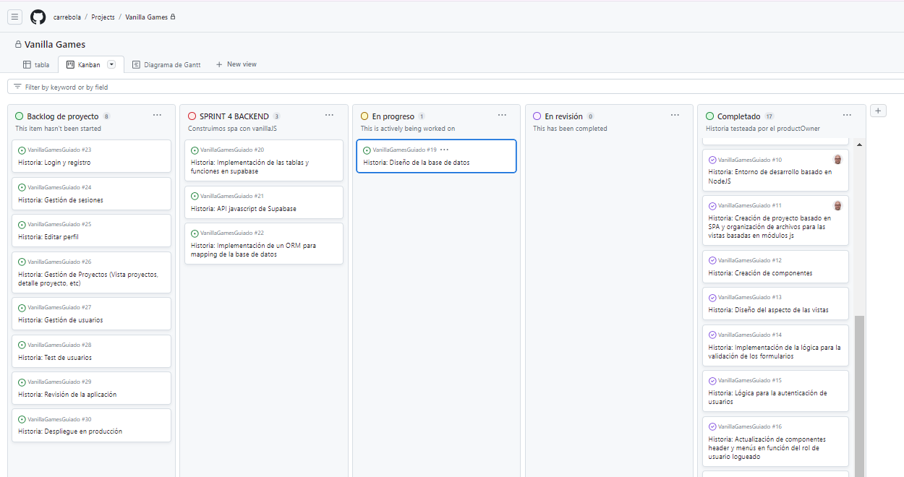

¡Comenzamos Sprint nuevo!



# Historia: Definición del mapping de acceso a la bd. Clases

El término "**mapping**" se refiere a la asignación de las propiedades de un objeto a las columnas de una tabla de una base de datos relacional. En este caso, la idea es que las propiedades de una clase JavaScript se correspondan con las columnas de una tabla en la base de datos Supabase.

Para definir un mapping en una aplicación de JavaScript con Supabase, primero debes crear una **clase** JavaScript que represente un registro de la tabla en cuestión. Cada **propiedad** de la clase se corresponderá con una **columna** en la tabla. Luego, puedes definir **métodos** estáticos en la clase para interactuar con la tabla (por ejemplo, leer, crear, actualizar o eliminar registros).

## Conexión con la base de datos

Es el momento de comenzar a construir nuestro la lógica para la comunicación con la base de datos en nuestro proyecto.

Como siempre, antes de comenzar a trabajar crearemos una rama nueva. Llamémosla... 'ORM'

Ahora instalamos en nuestro proyecto la librería de supabase para poder comenzar a trabajar con ella:

` npm install --save @supabase/supabase-js` 

Para conectarnos con la base de datos crearemos un objeto con la lógica de conexión que nos ofrece supabase. Para ello:
- Creamos el archivo `supabase.js` en la carpeta bd `src/bd/supabase.js`
- El archivo definimos la conexión usando los modelos de API Docs que ya testeamos en el apartado 'Probando Supabase', y la exportamos. El archivo quedaría así:
  
```js title="supabase.js"
import { createClient } from '@supabase/supabase-js'
//Creando la conexión con supabase
const supabaseUrl = 'xxxxxx'
const supabaseKey = 'xxxxxx'

//exportamos la conexión
export const supabase = createClient(supabaseUrl, supabaseKey)

``` 
## Clase Perfil

Vamos a definir la clase **Perfil** que utilizaremos para interactuar con una tabla de base de datos llamada **perfiles**. 

Utilizaremos **métodos static** los cuales pueden ser llamados desde la misma clase, sin necesidad de instanciar un objeto.

La clase Perfil tienen las siguientes propiedades: id, nombre, apellidos, user_id, estado, rol y avatar y los siguientes métodos:

- **constructor**: El constructor de la clase acepta los parámetros id, nombre, apellidos, user_id, estado, rol y avatar y los asigna a las propiedades correspondientes del objeto.
- **getAll**: Este método es **static** y devuelve una lista de todos los registros en la tabla perfiles. 
  Utiliza el método **select** de la librería supabase para seleccionar todos los registros de la tabla perfiles. Luego, utiliza el método **map** para **convertir cada registro en un objeto de la clase Perfil.**
- **getById**: Este método es **static** y acepta un parámetro id. Devuelve un objeto de la clase Perfil que tiene el id especificado.
  Utiliza el método **select** de la librería supabase para seleccionar el registro con el id especificado y el método **single** para devolver un solo registro. Luego, **devuelve un objeto de la clase Perfil** con los datos del registro seleccionado.
- **getByUserId**: Igual que el anterior pero más útil, ya que encuentra los datos de perfil a partir del **id** del **user**.
- **create**: Este método es **static** y acepta un objeto perfilData que contiene los datos para un nuevo registro de la tabla perfiles. 
  Utiliza el método **insert** de la librería supabase para insertar el nuevo registro en la tabla perfiles.
- **update**: Este método actualiza el registro de la tabla perfiles que tiene el mismo id que el objeto Perfil actual. 
  Utiliza el método **update** de la librería supabase para actualizar los campos nombre, apellidos y avatar del registro con los valores del objeto Perfil actual.
- **delete**: Este método es **static** y acepta un parámetro id. 
  Elimina el registro de la tabla perfiles que tiene el id especificado utilizando el método delete de la librería supabase. Devuelve **true** si la eliminación es exitosa.


En primer lugar creamos el archivo perfil.js dentro de la carpeta `bd`. 

Ahora importamos la conexión de supabase `import { supabase } from "./supabase.js";
` 
Y definimos la clase que vamos a exportar. El código quedaría así:

```js title="perfil.js"

// Importa el objeto 'supabase' desde un archivo 'supabase.js'
import { supabase } from './supabase.js'

// Definición de la clase Perfil
export class Perfil {
  // Constructor que inicializa las propiedades del perfil
  constructor({
    id = null, // ID único del perfil
    created_at = null, // Fecha de creación del perfil
    user_id = null, // ID del usuario asociado al perfil
    nombre = null, // Nombre del usuario
    apellidos = null, // Apellidos del usuario
    avatar = 'default_avatar.png', // URL del avatar por defecto
    estado = 'activo', // Estado del perfil (activo/inactivo, por ejemplo)
    rol = 'registrado' // Rol del usuario (registrado, administrador, etc.)
  }) {
    // Asignación de valores a las propiedades del perfil
    this.id = id
    this.created_at = created_at
    this.user_id = user_id
    this.nombre = nombre
    this.apellidos = apellidos
    this.avatar = avatar
    this.estado = estado
    this.rol = rol
  }

  // Método estático para obtener todos los perfiles
  static async getAll() {
    // Realiza una consulta a la base de datos para obtener todos los perfiles
    const { data: perfiles, error } = await supabase
      .from('perfiles')
      .select('*') // Selecciona todas las columnas
      .order('created_at', { ascending: false }) // Ordena por fecha de creación descendente

    // Manejo de errores: lanza una excepción si ocurre algún error
    if (error) {
      throw new Error(error.message)
    }

    // Mapea los perfiles obtenidos a instancias de la clase Perfil y los devuelve
    return perfiles.map((perfil) => new Perfil(perfil))
  }

  // Método estático para obtener un perfil por su ID
  static async getById(id) {
    // Realiza una consulta para obtener un perfil por su ID
    const { data: perfil, error } = await supabase
      .from('perfiles')
      .select('*')
      .eq('id', id) // Filtra por el ID especificado

    // Manejo de errores
    if (error) {
      throw new Error(error.message)
    }

    // Devuelve una instancia de Perfil con la información obtenida
    return new Perfil(perfil[0])
  }

  // Método estático para obtener un perfil por el ID del usuario asociado
  static async getByUserId(userId) {
    // Realiza una consulta para obtener un perfil por el ID de usuario asociado
    const { data: perfil, error } = await supabase
      .from('perfiles')
      .select('*')
      .eq('user_id', userId) // Filtra por el ID de usuario especificado

    // Manejo de errores
    if (error) {
      throw new Error(error.message)
    }

    // Devuelve una instancia de Perfil con la información obtenida
    return new Perfil(perfil[0])
  }

  // Método estático para crear un nuevo perfil
  static async create(perfilData) {
    // Inserta un nuevo perfil en la base de datos con los datos proporcionados
    const { data, error } = await supabase
      .from('perfiles')
      .insert(perfilData) // Inserta los datos del nuevo perfil
      .select() // Devuelve los datos insertados

    // Manejo de errores
    if (error) {
      throw new Error(`Error creando perfil: ${error.message}`)
    }

    // Si se insertaron datos, devuelve una nueva instancia de Perfil con los datos insertados
    return data ? new Perfil(data[0]) : null
  }

  // Método estático para actualizar un perfil existente por su ID
  static async update(id, newData) {
    // Actualiza un perfil existente en la base de datos con los nuevos datos
    const { error } = await supabase
      .from('perfiles')
      .update(newData) // Actualiza con los nuevos datos proporcionados
      .eq('id', id) // Filtra por el ID del perfil a actualizar

    // Manejo de errores
    if (error) {
      throw new Error(`Error actualizando perfil: ${error.message}`)
    }

    // Si la actualización fue exitosa, devuelve true
    return true
  }
}


```
## Clase User
Esta clase será diferente a la clase Perfil.

La clase User contiene tres métodos estáticos: **create**, **login** y **logout**, cada uno con una funcionalidad específica relacionada con la autenticación y el manejo de users.

Primero importamos la conexión a la base de datos a través de la biblioteca supabase.js.

Luego, en el constructor de la clase User definimos las propiedades de un usuario: **id**, **email** y **password**.

- **Método create**: Lo utilizaremos para crear un nuevo usuario en la base de datos. 
  Toma un objeto **userData** como argumento, que contiene las credenciales de usuario necesarias para crear un nuevo usuario en la base de datos. 
  El método utiliza la función **supabase.auth.signUp** para crear un nuevo usuario en la base de datos y **devuelve un objeto User** que contiene las propiedades id y email del nuevo usuario.

- **Método login**:  Lo utilizamos para iniciar sesión en la aplicación. 
  Toma un objeto userData que contiene las credenciales de inicio de sesión y utiliza la función **supabase.auth.signInWithPassword** para iniciar sesión en la base de datos. 
  **Devuelve un objeto User** que contiene las propiedades id y email del usuario que ha iniciado sesión.

- **Método logout**:  Lo utilizamos para cerrar sesión en la aplicación. 
  Utiliza la función **supabase.auth.signOut** para cerrar sesión y **devuelve true** si se ha cerrado con éxito.

- Método **getUser**:  Lo utilizamos para capturar los datos del usuario logueado.
  Utiliza la función **supabase.auth.getUser** para acceder a la sesión y **devuelve un objeto con el id y el email del usuario**.


```js title="user.js"
// Importamos la conexión a la base de datos desde './supabase.js'
import { supabase } from './supabase.js'

// Definición de la clase User
export class User {
  // Constructor que asigna propiedades básicas de un usuario
  constructor(id = null, email = null, password = null) {
    this.id = id
    this.email = email
    this.password = password
  }

  // Método estático para crear un nuevo usuario (registro)
  static async create(userData) {
    // Registra un nuevo usuario con Supabase
    const { data, error } = await supabase.auth.signUp(userData)

    // Manejo de errores
    if (error) {
      throw new Error(error.message)
    }

    // Si el usuario se crea correctamente, devuelve una instancia de User con el ID y el email
    console.log('usuario creado correctamente ', data)
    return new User(data.user.id, data.user.email)
  }

  // Método estático para iniciar sesión (recibe un objeto con email y password)
  static async login(userData) {
    // Inicia sesión con Supabase
    const { data, error } = await supabase.auth.signInWithPassword(userData)

    // Manejo de errores
    if (error) {
      throw new Error(error.message)
    }

    // Devuelve una instancia de User con el ID y el email del usuario logueado
    return new User(data.user.id, data.user.email)
  }

  // Método estático para cerrar sesión
  static async logout() {
    // Cierra sesión con Supabase
    const { error } = await supabase.auth.signOut()

    // Manejo de errores
    if (error) {
      throw new Error(error.message)
    }

    // Retorna true si el cierre de sesión fue exitoso
    return true
  }

  // Método estático para obtener el usuario actualmente logueado
  static async getUser() {
    // Obtiene la información del usuario actualmente logueado con Supabase
    const { data: { user } } = await supabase.auth.getUser()

    // Si hay un usuario logueado, devuelve una instancia de User con su ID y email
    if (user) return new User(user.id, user.email)
  }

  // Método para actualizar datos del usuario (no está claro cómo se utiliza actualmente)
  async update(nuevosDatos) {
    const { data, error } = await supabase.auth.updateUser({
      email: this.email,
      password: this.password
    })

    if (error) {
      throw new Error(error.message)
    }
  }
}

```

## Clase Proyecto

La clase **proyecto** es muy parecida a la clase perfil, por lo que partiremos del mismo archivo y lo modificaremos para adaptarlo a los campos de la **tabla proyecto**.

:::danger: ✏ Tarea
Crea el archivo proyecto.js con la clase correspondiente
:::


<div style={{display: "none"}}>

``` js title="proyecto.js"

// Importa el objeto 'supabase' desde un archivo 'supabase.js'
import { supabase } from './supabase.js'

// Definición de la clase Proyecto
export class Proyecto {
  // Constructor que inicializa las propiedades del proyecto
  constructor({
    id = null, // ID único del proyecto
    created_at = null, // Fecha de publicación del proyecto
    user_id = null, // ID del usuario que ha creado el proyecto
    nombre = null, // Nombre del proyecto
    descripcion = null, // Descripcion del proyecto
    imagen = 'default_image.png', // imagen por defecto
    enlace = null, // Enlace al proyecto publicado
    repositorio = null, // Enlace al repositorio
    estado = 'activo' // Estado del proyecto (activo/inactivo, por ejemplo)
  }) {
    // Asignación de valores a las propiedades del proyecto
    this.id = id
    this.created_at = created_at
    this.user_id = user_id
    this.nombre = nombre
    this.descripcion = descripcion
    this.imagen = imagen
    this.enlace = enlace
    this.repositorio = repositorio
    this.estado = estado
  }

  // Método estático para obtener todos los proyectos
  static async getAll() {
    // Realiza una consulta a la base de datos para obtener todos los proyectos
    const { data: proyectos, error } = await supabase
      .from('proyectos')
      .select('*') // Selecciona todas las columnas
      .order('created_at', { ascending: false }) // Ordena por fecha de creación descendente

    // Manejo de errores: lanza una excepción si ocurre algún error
    if (error) {
      throw new Error(error.message)
    }

    // Mapea los proyectos obtenidos a instancias de la clase Proyecto y los devuelve
    return proyectos.map((Proyecto) => new Proyecto(Proyecto))
  }

  // Método estático para obtener un Proyecto por su ID
  static async getById(id) {
    // Realiza una consulta para obtener un Proyecto por su ID
    const { data: Proyecto, error } = await supabase
      .from('proyectos')
      .select('*')
      .eq('id', id) // Filtra por el ID especificado
      .single() // Espera un solo resultado

    // Manejo de errores
    if (error) {
      throw new Error(error.message)
    }

    // Devuelve una instancia de Proyecto con la información obtenida
    return new Proyecto(Proyecto)
  }

  // Método estático para obtener un Proyecto por el ID del usuario asociado
  static async getByUserId(id) {
    // Realiza una consulta para obtener un Proyecto por el ID de usuario asociado
    const { data: Proyecto, error } = await supabase
      .from('proyectos')
      .select('*')
      .eq('user_id', id) // Filtra por el ID de usuario especificado
      .single()

    // Manejo de errores
    if (error) {
      throw new Error(error.message)
    }

    // Devuelve una instancia de Proyecto con la información obtenida
    return new Proyecto(Proyecto)
  }

  // Método estático para crear un nuevo Proyecto
  static async create(ProyectoData) {
    // Inserta un nuevo Proyecto en la base de datos con los datos proporcionados
    const { data, error } = await supabase
      .from('proyectos')
      .insert(ProyectoData) // Inserta los datos del nuevo Proyecto
      .select() // Devuelve los datos insertados

    // Manejo de errores
    if (error) {
      throw new Error(`Error creando Proyecto: ${error.message}`)
    }

    // Si se insertaron datos, devuelve una nueva instancia de Proyecto con los datos insertados
    return data ? new Proyecto(data[0]) : null
  }

  // Método estático para actualizar un Proyecto existente por su ID
  static async update(id, newData) {
    // Actualiza un Proyecto existente en la base de datos con los nuevos datos
    const { error } = await supabase
      .from('proyectos')
      .update(newData) // Actualiza con los nuevos datos proporcionados
      .eq('id', id) // Filtra por el ID del Proyecto a actualizar

    // Manejo de errores
    if (error) {
      throw new Error(`Error actualizando Proyecto: ${error.message}`)
    }

    // Si la actualización fue exitosa, devuelve true
    return true
  }
}


```
</div>

