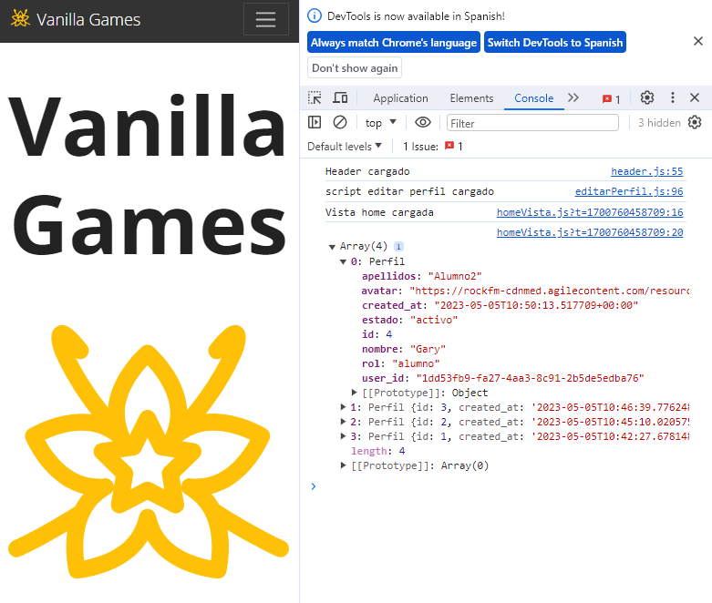
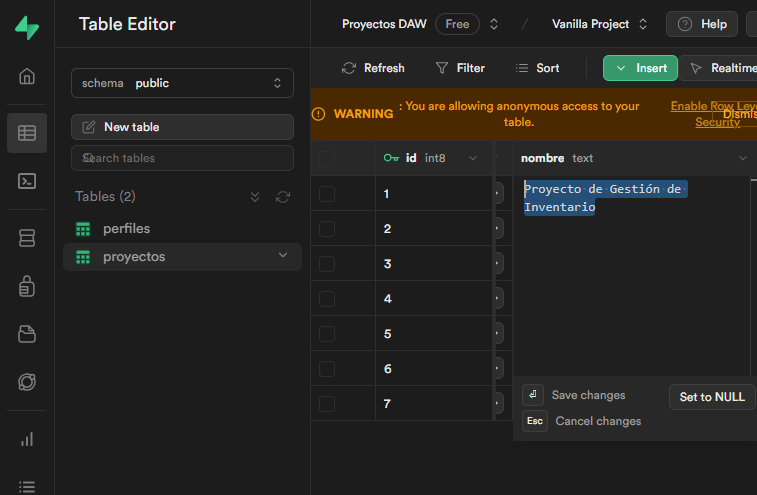
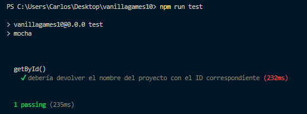

# Testing de las clases con Mocha y Chai

Es el momento de verificar que nuestras clases están haciendo su trabajo. 

Vamos a hacer una primera prueba simple para ver si podemos mostrar por la consola todos los perfiles que tenemos en la tabla `perfiles`.

Lo vamos a hacer 'a saco', y después, cuando ya estemos más tranquilos, usaremos una de herramienta muy utilizada en las empresas: El Testing. 

Pero por ahora hagamoslo a lo cutre.

## Probando la clase perfiles

Vamos a abrir la vista `homeVista.js` y vamos a colocar nuestro código en el método script que luego llamaremos.

```js title="vistaHome.js" {2,9,13}
// Importamos la clase
import { Perfil } from '../bd/perfil'

export default {
  template: // html
  `
    ...
  `,
  script: async () => {
    console.log('Vista home cargada')

    // Probando la clase Pefil
    const resultado = await Perfil.getAll()
    console.log(resultado)
  }
}

```
:::info Fíjate

Hay un par de cosas que debes tener en cuenta:
- Nuestro script() debe llevar delante la palabra `async` y delante de la clase *Perfil* debemos poner `await`. Esto es porque estamos trabajando con AJAX... pero de eso ya hablaremos en otro momento 
- No olvides importar la clase con `import` en la parte superior del archivo

:::

Si todo ha ido bien, deberias ver en la consola de la página principal algo así:



¡¡¡Genial!!! Todo va según lo previsto. Ahora mejor borramos el código de la vista Home no se nos vaya a olvidar...


## Testing con Mocha y Chai

Tal y como hemos comentado antes, una buena idea es testear todas las clases para poder asegurarnos de que la conexión con la base de datos se realiza de forma correcta y todo funciona según lo esperado

Para hacer los **tests unitarios** hemos utilizado **mocha** y **chai**.

:::info Qué son Mocha y Chai
"Mocha" y "Chai" en el contexto del testing con JavaScript son frameworks populares para escribir y ejecutar pruebas (tests) automatizadas en aplicaciones web.

**Mocha**: Es un framework de pruebas que te permite escribir pruebas de manera sencilla y flexible en JavaScript. Proporciona una estructura clara para organizar tus pruebas y es compatible tanto con el navegador como con Node.js.

**Chai**: Por otro lado, Chai es una librería de aserciones (assertions) que se utiliza junto con Mocha u otros frameworks de pruebas. Con Chai, puedes escribir declaraciones de expectativas de una manera muy legible y expresiva. Viene con diferentes estilos para las aserciones, como el estilo "should", "expect" y "assert".

<details>
<summary>Un ejemplo de uso</summary>

Un ejemplo sencillo sería escribir pruebas para una función matemática que sume dos números utilizando Mocha y Chai:

Supongamos que tienes una función llamada sumar en un archivo matematicas.js:

```javascript
Copy code
// matematicas.js
function sumar(a, b) {
  return a + b;
}
module.exports = sumar;
```

Y quieres escribir pruebas para esta función usando Mocha y Chai en un archivo test.js:

```javascript
Copy code
// test.js
const chai = require('chai');
const expect = chai.expect;
const sumar = require('./matematicas');

describe('Función sumar', function() {
  it('debería sumar dos números correctamente', function() {
    expect(sumar(2, 3)).to.equal(5);
  });

  it('debería devolver un resultado incorrecto si se pasan strings', function() {
    expect(sumar('2', '3')).to.be.a('string');
    expect(sumar('2', '3')).to.not.equal(5);
  });
});

```
En este ejemplo, estamos utilizando Mocha para estructurar nuestras pruebas con **describe** y **it**, y Chai para realizar las aserciones con **expect**, verificando el comportamiento esperado de la función sumar.

</details>


Estos frameworks son muy útiles para escribir pruebas de calidad y garantizar que tu código funcione como se espera en diferentes situaciones.
:::

## Creando las pruebas con Mocha i Chai

- Primero instalamos las librerias mediante el gestor de paquetes: `npm install mocha chai -D`
- En el archivo `package.json` añadimos el script para pasar los tests: 
```js title="package.json" {6}
"scripts": {
    "dev": "vite",
    "build": "vite build --emptyOutDir",
    "preview": "vite preview",
    "deploy": "gh-pages -d dist",
    "test": "mocha"
  },
```

- Ahora ya podemos crear una carpeta en la raiz del proyecto con nombre `test` y dentro colocar nuestros archivos con el código que queremos testear. En este caso comenzamos con `perfil.test.js`

Primero vamos a hacer una prueba muy sencilla. Vamos a consultar los datos del primer proyecto que tenemos en la tabla 'proyectos'. ¿Recuerdas qué método debemos utilizar?... Efectivamente, `Proyecto.getById()`

Pero antes vamos a Supabase para consultar nuestra tabla `proyectos`.



Vamos a testear el método `Proyecto.getById(*1*)`, consultando el nombre del proyecto. Si todo es correcto debería devolvernos el texto: *Proyecto de Gestión de Inventario*


Esto es lo que queremos hacer:

- Importación de Librerías:

  - Importamos la función **expect** de la librería **Chai**, que se utiliza para realizar **aserciones** en las pruebas.
  - Importamos el objeto **supabase** desde un archivo llamado supabase.js, para acceder a una base de datos usando Supabase.
  - Importamos la **clase Proyecto** desde un archivo proyecto.js.

- Estructura de Pruebas:

  - Usa `describe` para agrupar pruebas relacionadas. En este caso, se está describiendo la función getById().
  - `it` describe una prueba específica que verifica una funcionalidad en particular. En este caso, se está probando que al obtener un proyecto por su ID, se devuelve el nombre correcto.

- Prueba:

  - Se ejecuta una prueba asincrónica (indicada por async function), donde se espera obtener un proyecto utilizando **Proyecto.getById(1)** (ya que queremos los datos del proyecto con ID=1).
  - Utiliza `expect` de **Chai** para verificar si el nombre del proyecto obtenido (proyecto.nombre) es igual a 'Proyecto de Gestión de Inventario'.


Y este sería el código correspondiente:

Este sería el código del script para hacer el test:

```js title="proyecto.test.js"
// Cargamos libreria de testing
import { expect } from 'chai'

// cargamos libreria de supabase
import { supabase } from '../src/bd/supabase.js'

// Cargamos la clase Proyecto
import { Proyecto } from '../src/bd/proyecto.js'

describe('getById()', function () {
  it('debería devolver el nombre del proyecto con el ID correspondiente', async function () {
    // Obtener el proyecto por ID
    const proyecto = await Proyecto.getById(1)
    // Esperamos que el nombre coincida
    expect(proyecto.nombre).equal('Proyecto de Gestión de Inventario')
  })
})
```

Para ejecutar el test solo tenemos que escribir en la consola: `npm run test`. Esto ejecutará todos los archivos test que encuentre en la carpeta. 

El resultado mostrado sería el siguiente:




