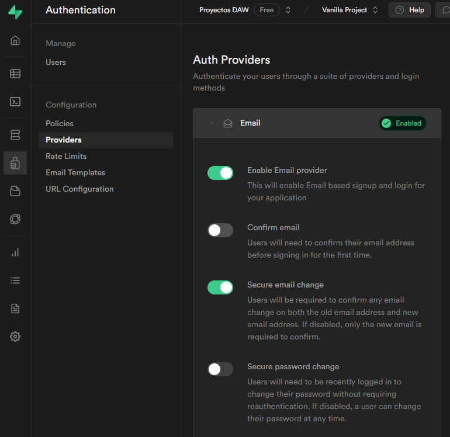
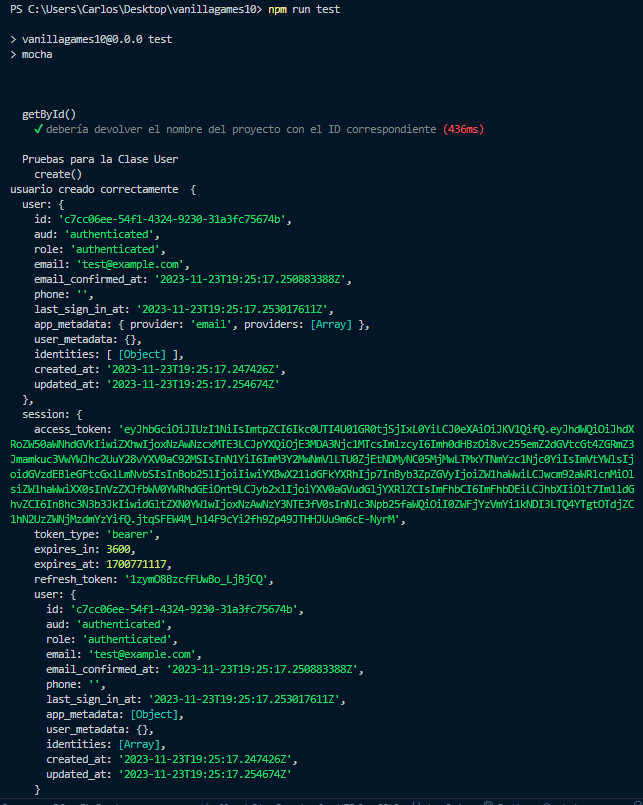
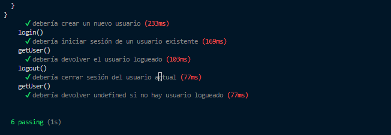

Ahora ya va en serio, vamos a empezar testeando la clase User.

Esto es lo que vamos a hacer:

1. **Creación de Usuario**: Utilizando el método create() de la clase User, se crea un nuevo usuario con un email y contraseña. Se verifica que el usuario creado sea una instancia válida de User y que su email coincida con el proporcionado.

2. **Inicio de Sesión**: Se intenta iniciar sesión con el usuario creado utilizando el método login(). Se verifica que el usuario creado siga siendo una instancia válida de User y que el usuario logueado tenga el mismo email que se usó para crearlo.

3. **Obtención del Usuario Logueado**: Se verifica que el método getUser() de la clase User devuelva el usuario logueado. Se comprueba que se haya obtenido un usuario, que sea una instancia válida de User y que el email del usuario logueado coincida con el que se utilizó previamente.

4. **Cierre de Sesión**: Se intenta cerrar la sesión del usuario actual con el método logout(). Se verifica que el proceso de cierre de sesión se realice con éxito y devuelva true."

5. **Leer usuario tras cerrar sesión**: Se intenta leer los datos del usuario logueado actual con el método getUser(). Se verifica que el proceso de cierre de sesión ha realizado bien por lo que devuelve *undefined*.

Pero antes, debemos eliminar la opción de supabase que nos obliga a confirmar la creación de un usuario nuevo mediante la respuesta al email que nos envía el sistema.

Para ello nos vamos a supabase, **autenticación** y **Providers**, y modificamos, del proveedor de **Email**, la opción '**Confirm email**'



Ahora sí, ya podemos escribir el código del test y ejecutarlo:

```js title="user.test.js
import { expect } from 'chai'

import { User } from '../src/bd/user.js'

// cargamos libreria de supabase
import { supabase } from '../src/bd/supabase.js'

describe('Pruebas para la Clase User', function () {
  let usuarioCreado // Variable para almacenar el usuario creado durante las pruebas

  describe('create()', function () {
    it('debería crear un nuevo usuario', async function () {
      const datosUsuario = { email: 'test@example.com', password: 'testPassword' }

      usuarioCreado = await User.create(datosUsuario)

      expect(usuarioCreado).to.be.an.instanceOf(User)
      expect(usuarioCreado.email).to.equal('test@example.com')
    })
  })

  describe('login()', function () {
    it('debería iniciar sesión de un usuario existente', async function () {
      expect(usuarioCreado).to.be.an.instanceOf(User)

      const datosLogin = { email: 'test@example.com', password: 'testPassword' }

      const usuarioLogueado = await User.login(datosLogin)

      expect(usuarioLogueado).to.be.an.instanceOf(User)
      expect(usuarioLogueado.email).to.equal('test@example.com')
    })
  })

  describe('getUser()', function () {
    it('debería devolver el usuario logueado', async function () {
      // Supongamos que 'usuarioLogueado' es el usuario que se espera obtener al estar logueado
      const usuarioLogueado = await User.getUser()

      // Verificamos que se haya obtenido el usuario esperado
      expect(usuarioLogueado).to.exist // Aseguramos que haya un usuario logueado
      expect(usuarioLogueado).to.be.an.instanceOf(User) // Verificamos que sea una instancia de User

      // Verificamos la propiedad 'email' del usuario logueado
      expect(usuarioLogueado.email).to.equal('test@example.com') // Reemplaza 'correo@example.com' con el email esperado del usuario logueado
    })
  })

  

  describe('logout()', function () {
    it('debería cerrar sesión del usuario actual', async function () {
      const sesionCerrada = await User.logout()

      expect(sesionCerrada).to.equal(true)
    })
  })

  describe('getUser()', function () {
    it('debería devolver undefined si no hay usuario logueado', async function () {
      // Supongamos que 'usuarioLogueado' es el usuario que se espera obtener al estar logueado
      const usuarioLogueado = await User.getUser()

      // Verificamos que el usuario logueado sea undefined, indicando que no hay sesión activa
      expect(usuarioLogueado).to.equal(undefined)
      // También podríamos usar:
      // expect(usuarioLogueado).to.be.undefined;
      // o
      // expect(usuarioLogueado).to.not.exist;
    })
  })
})

```
Al ejecutar el test con `npm run test` obtenemos estos resultados:




:::note Ten en cuenta que
En este test **no hemos borrado el usuario creado**, ya que después lo vamos a necesitar para probar el resto de clases.

Si el test falla y debes volver a ejecutarlo **deberás borrar a mano este usuario**.
:::


Ya hemos testeado con absoluto éxito la clase User. Ahora tocaría escribir los test para la clase **Perfil** y la clase **Proyecto**

