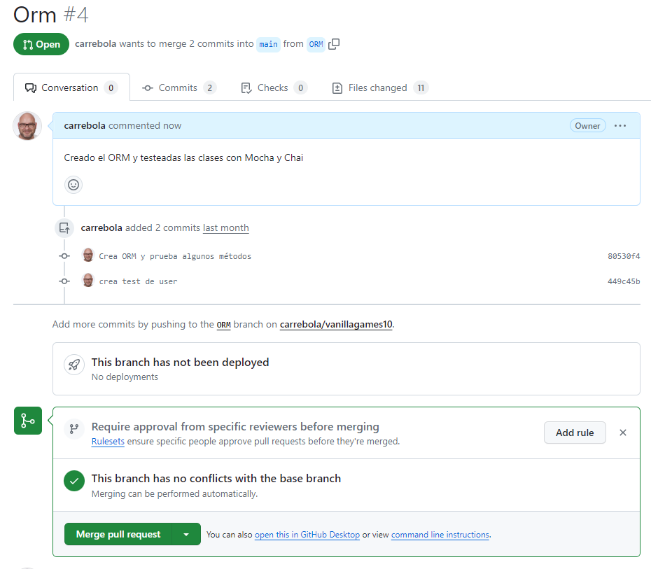

# Testeando la clase Proyectos

Este test te lo voy a dejar a tí...

:::info ✍ Tarea: Crea los test para la clase Proyectos
:::

:::warning Commit y PullRequest

Una vez testeado el orm, es el momento de unir la rama ORM a través de un pullRequets

:::

