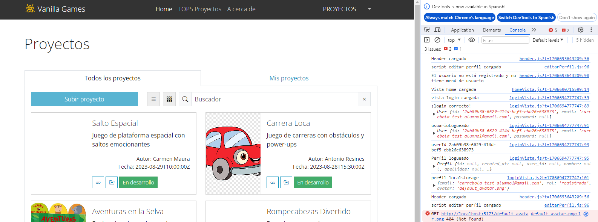
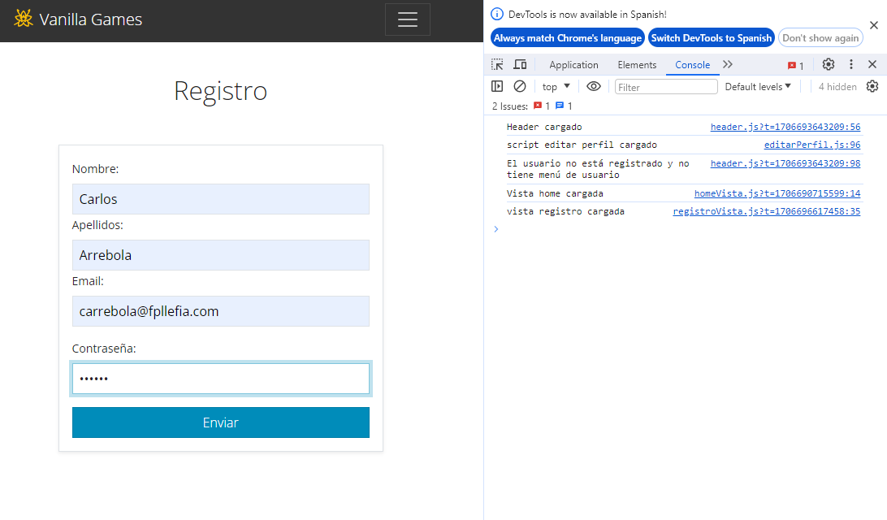
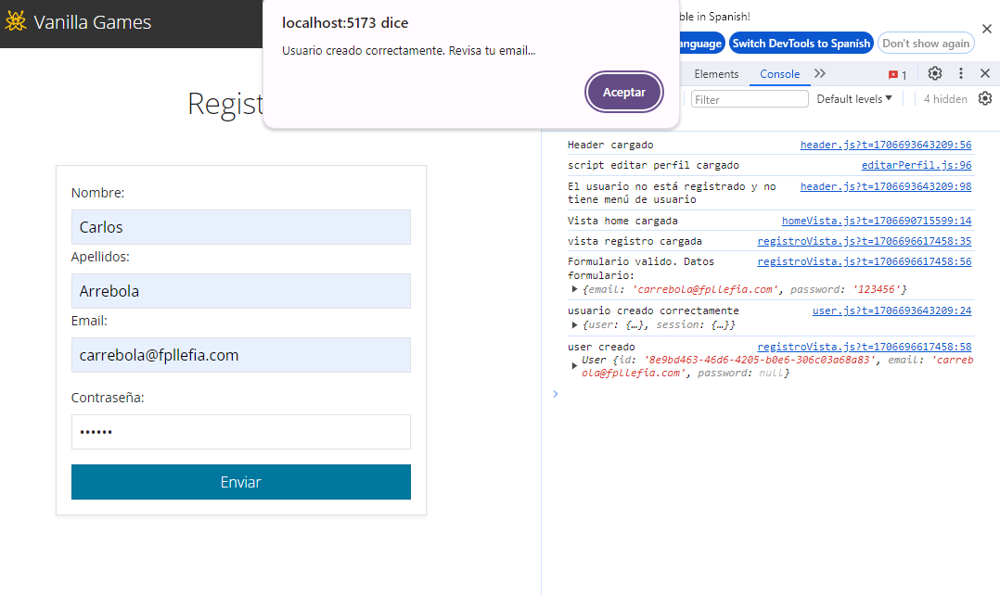

Comenzamos la historia actualizando las vistas y componentes para el login y el registro

## LoginVista
Esta vista nos permite iniciar sesión. Si revisamos el código script podemos encontrar la función encargada de enviar los datos a la base de datos: 

```js title='loginVista.js

// Función para enviar datos a la bd
    function enviarDatos (formulario) {
      const email = formulario.email.value
      const pass = formulario.password.value

      // buscamos el indice del email en el array perfiles
      const indexUser = perfiles.findIndex((user) => user.email === email) // 1
      // Si encuentra un usuario
      if (indexUser > 0) {
        // Si la contraseña es correcta
        if (perfiles[indexUser].contraseña === pass) {
          console.log('¡login correcto!')
          const usuario = {
            nombre: perfiles[indexUser].nombre,
            apellidos: perfiles[indexUser].apellidos,
            email: perfiles[indexUser].email,
            rol: perfiles[indexUser].rol,
            avatar: perfiles[indexUser].avatar,
            user_id: perfiles[indexUser].user_id
          }
          // Guardamos datos de usaurio en localstorage
          ls.setUsuario(usuario)
          // Cargamos página home
          window.location = '#/proyectos'
          // Actualizamos el header para que se muestren los menús que corresponden al rol
          header.script()
        } else {
          console.log('La contraseña no corresponde')
          alert('El usuario no existe o la contraseña no es correcta')
        }
      } else {
        console.log('El usuario no existe')
        alert('El usuario no existe o la contraseña no es correcta')
      }
    }

```

Fíjate que en este código, en la función `enviarDatos()` lo que hacemos es buscar en el array `'Perfiles'` un usuario y mirar si la contraseña coincide. 
Vamos a sustituir este código por el método login() de nuestra clase 'user'

*No olvides importar user.js*

`import { User } from '../bd/user'`

La nueva función `enviarDatos` quedaría así:

```javascript title="loginVista"
...

// Función para enviar datos a la bd
// Función para enviar datos a la bd
    async function enviarDatos(formulario) {
      try {
        // login
        const user = {
          email: formulario.email.value,
          password: formulario.password.value
        }
        User.logout()
        const usuarioLogueado = await User.login(user)
        console.log('¡login correcto!', usuarioLogueado)
        // Ahora vamos a capturar los datos del perfil del usuario logueado
        console.log('usuarioLogueado', usuarioLogueado);
        const userId = usuarioLogueado.id
        console.log('userId', userId);
        const perfilLogueado = await Perfil.getByUserId(userId)
        console.log('Perfil logueado', perfilLogueado);
        const usuario = {
          email: usuarioLogueado.email,
          rol: perfilLogueado.rol,
          avatar: perfilLogueado.avatar
        }
        console.log('perfil localstorage', usuario);
        // Guardamos datos de usaurio en localstorage
        ls.setUsuario(usuario)
        // Cargamos página home
        window.location = '#/proyectos'
        // Actualizamos el header para que se muestren los menús que corresponden al rol
        header.script()
      } catch (error) {
        console.log('Error al iniciar sesión', error)
        alert('El usuario no existe o la contraseña no es correcta', error)
      }
    }

```

Vamos a ver si todo va según lo previsto. Prueba a introducir un usuario no registrado, una contraseña incorrecta y finalmente uno correcto. Deberíamos ver algo así:



:::danger ✍ TAREA: Repara errores
Ummmm, parece que hay algunos errores, como que alguna imagen no se ve (la del avatar)... Eso lo dejo en tus manos
:::


## Logout

Para cerrar la sesión debemos modificar la función que encontramos en el componente header

```javascript title =" header.js"
// Cerrar sesión
    // Capturamos clic sobre el item de cerrar sesión
    document.querySelector('header').addEventListener('click', (e) => {
      if (e.target.classList.contains('cerrarSesion')) {
        e.preventDefault()
        // Borramos el localstorage
        ls.setUsuario('')
        // Cargamos la pagina home
        window.location = '#/home'
        header.script()
      }
    })

```

Incorporando nuestras clases quedaría así:

Primero importamos la clase User:

`import { User } from '../bd/user'`

```javascript title="header.js"
...
// Cerrar sesión
    // Capturamos clic sobre el item de cerrar sesión
    document.querySelector('header').addEventListener('click', (e) => {
      if (e.target.classList.contains('cerrarSesion')) {
        e.preventDefault()

        // Cerramos sesión en la bd
        User.logout()
        // Borramos el localstorage
        ls.setUsuario('')
        // Cargamos la pagina home
        window.location = '#/home'
        header.script()
      }
    })
```
Prueba para ver si todo va como esperamos...


## Registro

Para el registro usaremos el método create de User.
Veamos el código de la vista `registroVista.js`

```javascript title="registroVista.js"

 script: () => {
    console.log('vista registro cargada')
    // Validación bootstrap

    // Capturamos el formulario en una variable
    const formulario = document.querySelector('form')
    // Detectamos su evento submit (enviar)
    formulario.addEventListener('submit', (event) => {
    // Comprobamos si el formulario no valida
      if (!formulario.checkValidity()) {
      // Detenemos el evento enviar (submit)
        event.preventDefault()
        event.stopPropagation()
      }
      // Y añadimos la clase 'was-validate' para que se muestren los mensajes
      formulario.classList.add('was-validated')
    })
  }

  ```
Aquí lo que haremos es registrar un usuario usando la clase `User` y después crear un perfil nuevo a través de la clase `Perfil`, empleando los datos del formulario y el `user_id` que nos devuelve el metodo `User.create()`

```javascript title="registroVista.js"
  script: () => {
    console.log('vista registro cargada')
    // Validación bootstrap

    // Capturamos el formulario en una variable
    const formulario = document.querySelector('#formularioRegistro')
    // Detectamos su evento submit (enviar)
    formulario.addEventListener('submit', async (event) => {
      // Detenemos el evento enviar (submit)
      event.preventDefault()
      event.stopPropagation()
      // Comprobamos si el formulario no valida
      if (!formulario.checkValidity()) {
        // Y añadimos la clase 'was-validate' para que se muestren los mensajes
        formulario.classList.add('was-validated')
      } else {
        try {
          // Capturamos datos del formulario para el registro
          const usuario = {
            email: formulario.email.value,
            password: formulario.password.value
          }
          console.log('Formulario valido. Datos formulario: ', usuario)
          const user = await User.create(usuario)
          console.log('user creado', user)

          // Capturamos datos del formulario para el perfil
          const perfil = {
            ...usuario,
            user_id: user.id,
            nombre: formulario.nombre.value,
            apellidos: formulario.apellidos.value
          }
          // Insertamos perfil en la base de datos
          Perfil.create(perfil)

          alert('Usuario creado correctamente. Revisa tu email...')
          window.location = '#/login'
        } catch (error) {
          alert('Error al crear usuario', error)
        }
      }
    })
  }
```

Si todo ha ido bien podrás ver como en la base de datos se han creado los registros correspondientes y en nuestra web se muestra el header con los datos correspondientes.






:::warning Commit!
Es un buen momento para subir nuestro trabajo al repositorio
:::

