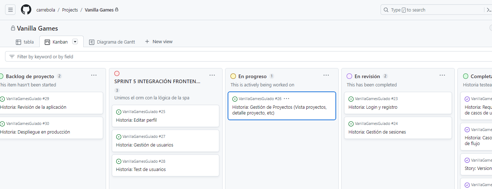
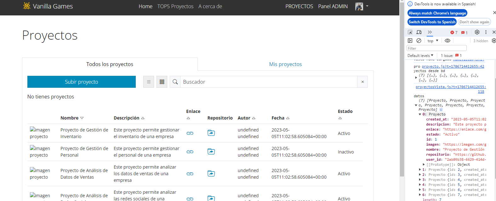

Vamos a actualizar la lógica para la gestión de proyectos.



## ProyectosVista

De toda la lógica del script nos interesa solo estas líneas:

```javascript title="proyectosVista.js"
 // Capturamos proyectos y guardamos en variable para poder ser filtrada
    const datos = proyectos
```
Lo único que tenemos que hacer es cargar la clase `proyecto`

`import { Proyecto } from '../bd/proyecto'
`

y sustuir el array proyectos por nuestra consulta. 

El resultado se acerca a lo esperado aunque hay que solucionar algunas cosillas...



Por ejemplo, la fecha sale en un formato donde se indica las horas, minutos, etc... Mejor quedarnos solo con el día, ¿no?

Para solucionarlo podemos: 
1. Recortar el resultado por la 'T' y quedarnos la primera parte. 
2. Separar el año, mes y dia por el '-' y reordenarlo utilizando '/'

Podríamos usar este código:
```javascript 
const nuevaFecha = fecha.split('T')[0]
const fechaFormateada = `${nuevaFecha.split('-')[2]}/${nuevaFecha.split('-')[1]}7${nuevaFecha.split('-')[0]}`
```

:::info
Otra manera podría ser la siguiente: 
```javascript 
${(new Date(fechaOriginal)).toISOString().split('T')[0]}
```
:::

Y quedaría así:

```javascript
// Capturamos proyectos y guardamos en variable para poder ser filtrada
    const datosBd = await Proyecto.getAll()
    console.log('datos', datosBd)
    const datos = datosBd.map((dato) => {
      const fecha = dato.created_at
      const nuevaFecha = fecha.split('T')[0]
      const fechaFormateada = `${nuevaFecha.split('-')[2]}/${nuevaFecha.split('-')[1]}/${nuevaFecha.split('-')[0]}`
      const datoFormateado = {
        ...dato,
        created_at: fechaFormateada
      }
      return datoFormateado
    })
```

Ahora tenemos el problema del autor. Este es más serio ya que, si te fijas, nuestra consulta no nos devuelve el nombre del autor, tan solo su user_id.

Para solucionar esto debemos modificar el método que hace la consulta. Pero esto lo haremos más adelante...


## ProyectoNuevoVista

En este caso debemos modficar la función enviaDatos(). Podría quedar algo así:

```javascript title="proyectoNuevoVista.js"
// Función para enviar datos a la base de datos
    async function enviaDatos() {
      try {
        const proyectoEditado = {
          // Asignación de valores a las propiedades del proyecto
          imagen: document.querySelector('#urlImagen').value,
          nombre: document.querySelector('#nombreJuego').value,
          descripcion: document.querySelector('#descripcion').value,
          created_at: document.querySelector('#fecha').value,
          estado: document.querySelector('#estado').value,
          enlace: document.querySelector('#enlace').value,
          repositorio: document.querySelector('#repositorio').value
        }
        const proyectoCreado = await Proyecto.create(proyectoEditado)
        alert('Proyecto creado con éxito', proyectoCreado.nombre)
        console.log('Enviando a la base de datos ', proyectoCreado)
        window.location = '#/proyectos'
      } catch (error) {
        alert('Error al crear el proyecto', error)
      }
    }
```

Si analizas con detalles su funcionamiento verás que, hemos modificado la propiedad **fecha** por la propiedad **created_at**, que es el nombre del campo que tenemos en la tabla `proyectos` de nuestra base de datos.

Otra cosa a tener en cuenta es que, **¡no hemos añadido el user_id!**, por lo tanto no podemos saber quien ha creado el proyecto.

Esto tiene fácil solución. Solo tenemos que usar el método getUser() de la clase User.


Al final, la cosa quedaría así: 
```javascript title="proyectoNuevoVista.js"
// Función para enviar datos a la base de datos
    async function enviaDatos() {
      try {
        const user = await User.getUser()
        const userId = user.id

        const proyectoEditado = {
          // Asignación de valores a las propiedades del proyecto
          imagen: document.querySelector('#urlImagen').value,
          nombre: document.querySelector('#nombreJuego').value,
          descripcion: document.querySelector('#descripcion').value,
          created_at: document.querySelector('#fecha').value,
          estado: document.querySelector('#estado').value,
          enlace: document.querySelector('#enlace').value,
          repositorio: document.querySelector('#repositorio').value,
          user_id: userId
        }
        const proyectoCreado = await Proyecto.create(proyectoEditado)
        alert('Proyecto creado con éxito', proyectoCreado.nombre)
        console.log('Enviando a la base de datos ', proyectoCreado)
        window.location = '#/proyectos'
      } catch (error) {
        alert('Error al crear el proyecto', error)
      }
    }
```

## Mis proyectos

Ahora que podemos crear proyectos vamos a regresar a la vista `proyetosVista.js` para modificar la lógica que se encarga de mostrar los proyectos que ha creado el usuario que tiene la sesión abierta.

Para ello haremos lo mismo, utilizaremos el User.getUser() para obtener el user_id del usuario logueado. El código quedaría de la siguiente manera:

```javascript title="proyectosVista.js"
script: async () => {
    // **** AQUI DEBEMOS CAPTURAR LOS PROYECTOS DE LA BASE DE DATOS ****

    // Capturamos proyectos y guardamos en variable para poder ser filtrada
    const datosBd = await Proyecto.getAll()
    console.log('datos', datosBd)
    const user = await User.getUser()
    const userId = user.id
    console.log('userId',userId);
    const datos = datosBd.map((dato) => {
      const fecha = dato.created_at
      const nuevaFecha = fecha.split('T')[0]
      const fechaFormateada = `${nuevaFecha.split('-')[2]}/${nuevaFecha.split('-')[1]}/${nuevaFecha.split('-')[0]}`
      const datoFormateado = {
        ...dato,
        created_at: fechaFormateada
      }
      return datoFormateado
    })

    let misProyectos = false
    // Capturamos los datos del usuario logueado
    const usuario = ls.getUsuario()
    console.log(usuario);

    // ####################################################################
    // *** FUNCIÓN PARA PINTAR TABLA A PARTIR DE ARRAY datos ***
    // ####################################################################

    const pintaTabla = (proyectosFiltrados) => {
      // Si tenemos seleccionada la opción 'mis proyectos' filtramos los proyectos por user_id
      if (misProyectos) {
        proyectosFiltrados = proyectosFiltrados.filter((proyecto) => proyecto.user_id === userId)
      }

      let tbodyProyectos = ''
      // Iteramos para cada proyecto del array 'proyectos'
      proyectosFiltrados.forEach(proyecto => {
        // Generamos botones dependiendo de si el proyecto ha sido creado por el usuario logueado
        let botones = ''
        if (userId === proyecto.user_id) {
          botones =
            `
          <td><a
            data-id = ${proyecto.id}
            class="botonAdmin botonEditar d-none d-sm-inline btn btn-sm btn-outline-primary bi bi-pencil"
          ></a></td>
          <td><a
            data-id = ${proyecto.id}
            class="botonAdmin botonBorrar d-none d-sm-inline btn btn-sm btn-outline-danger bi bi-trash3"
          ></a></td>
          `
        }
        // sumamos un tr con los datos del proyecto de la iteración
        tbodyProyectos += // html
          `
        <tr data-id="${proyecto.id}" class="verDetalle">
          <td>
            <div class="containerImagen">
              
            </div>
          </td>
          <td>${proyecto.nombre}</td>
          <td>${proyecto.descripcion}</td>
          <td><a href="${proyecto.enlace}" target="_blank"><i class="bi bi-link fs-4"></i></a></td>
          <td><a href="${proyecto.repositorio}" target="_blank"><i class="bi bi-folder-symlink fs-4"></i></a></td>
          <td>${proyecto.nombre_usuario} ${proyecto.apellidos_usuario}</td>
          <td>${proyecto.created_at}</td>
          <td>${proyecto.estado}</td>
          <td>
            <!-- Botones de edición y borrado -->
            ${botones}
          </td>
        </tr>   
        `
      })
      // inyectamos el resultado en el tbody
      document.querySelector('#tbodyProyectos').innerHTML = tbodyProyectos
    }

    // ####################################################################
    // Función para pintar tarjetas
    // ####################################################################

    const pintaTarjetas = (proyectosFiltrados) => {
      // Si tenemos seleccionada la opción 'mis proyectos' filtramos los proyectos por user_id
      if (misProyectos) {
        proyectosFiltrados = proyectosFiltrados.filter((proyecto) => proyecto.user_id === userId)
        console.log('proyectosUserId', proyectosFiltrados)
      }
      let tarjetasProyectos = ''
      // Iteramos para cada proyecto del array 'proyectosFiltrados'
      proyectosFiltrados.forEach(proyecto => {
        // Generamos botones dependiendo de si el proyecto ha sido creado por el usuario logueado
        let botones = ''
        if (usuario.user_id === proyecto.user_id) {
          botones =
            `
          <a
            data-id = ${proyecto.id}
            class="botonAdmin botonEditar d-none d-sm-inline btn btn-sm btn-outline-primary bi bi-pencil"
          ></a>
          <a
            data-id = ${proyecto.id}
            class="botonAdmin botonBorrar d-none d-sm-inline btn btn-sm btn-outline-danger bi bi-trash3"
          ></a>
          `
        }
        // sumamos un tr con los datos del proyecto
        tarjetasProyectos += // html
          `
        <!-- tarjeta  -->
        <div class="col-12 col-lg-6">
          <div class="card mb-3">
            <div class="row g-0">
              <div
                class="col-4 verDetalle"
                data-id="${proyecto.id}"
                style="
                  background-image: url(${proyecto.imagen || 'images/imagenVacia.png'});
                  background-position: center;
                  background-size: cover;
                "
              ></div>
              <div class="col-8">
                <div class="card-body">
                  <h5 class="card-title">${proyecto.nombre}</h5>
                  <p class="card-text">
                    ${proyecto.descripcion}
                  </p>
                  <p class="small m-0 text-end text-italic">Autor: ${proyecto.nombre_usuario} ${proyecto.apellidos_usuario}</p>
                  <p class="small text-end text-italic">Fecha: ${proyecto.created_at}</p>
                  <a class="btn btn-sm btn-outline-primary" href="${proyecto.enlace}" target="_blank"><i class="bi bi-link"></i></a>
                  <a class="btn btn-sm btn-outline-primary" href="${proyecto.repositorio}" target="_blank"><i class="bi bi-folder-symlink"></i></a>
                  <button class="btn btn-sm btn-success">${proyecto.estado}</button>
                  <!-- Botones editar y borrar -->
                  ${botones}
                </div>
              </div>
            </div>
          </div>
        </div>  
        `
      })
      // inyectamos el resultado en tbody
      document.querySelector('#tabTarjetas').innerHTML = tarjetasProyectos
    }

    // *** Pintamos los datos en tabla y tarjetas ***
    pintaTabla(datos)
    pintaTarjetas(datos)

    // ####################################################################
    // *** SELECCIÓN DE VISTA EN FORMATO TABLA O TARJETAS ***
    // ####################################################################

    // Selección vista tabla
    document.querySelector('.vistaTabla').addEventListener('click', (boton) => {
      // Lineas originales del html para los tabs:
      // <div class="col-12 d-none d-xl-block" style="overflow-x: auto">
      // <div class="d-xl-none row">

      // Pinta el boton de verde
      boton.target.classList.add('btn-success')

      // Pinta el otro botón de gris y elimina el verde
      const botonTarjeta = document.querySelector('.vistaTarjetas')
      botonTarjeta.classList.remove('btn-success')
      botonTarjeta.classList.add('btn-secondary')

      // Muestra y oculta los tabs
      document.querySelector('#tabTabla').setAttribute('class', 'col-12 d-block')
      document.querySelector('#tabTarjetas').setAttribute('class', 'd-none')
    })

    // Selección vista tarjetas
    document.querySelector('.vistaTarjetas').addEventListener('click', (boton) => {
      console.log('vistaTarjetas')

      // Pinta el boton de verde
      boton.target.classList.add('btn-success')

      // Pinta el otro botón de gris y elimina el verde
      const botonTabla = document.querySelector('.vistaTabla')
      botonTabla.classList.remove('btn-success')
      botonTabla.classList.add('btn-secondary')

      // Muestra y oculta los tabs
      document.querySelector('#tabTabla').setAttribute('class', 'd-none')
      document.querySelector('#tabTarjetas').setAttribute('class', 'row')
    })

    // ####################################################################
    // *** FILTRO PARA BUSCADOR ***
    // ####################################################################

    // Capturamos el input de búsqueda
    const inputBusqueda = document.getElementById('inputBusqueda')

    // Agregamos un evento de escucha para el evento de entrada en el input de búsqueda
    inputBusqueda.addEventListener('input', () => {
      // Capturamos el texto de búsqueda del input, conviértelo a minúsculas y elimina espacios en blanco al principio y al final
      const textoBusqueda = inputBusqueda.value.toLowerCase().trim()

      // Filtramos los proyectos que coinciden con el texto de búsqueda en cualquier campo
      const proyectosFiltrados = datos.filter(proyecto => {
        // Itera sobre las propiedades (campos) de cada proyecto
        for (const key in proyecto) {
          // Obtenemos el valor del campo actual
          const valorCampo = proyecto[key]
          // Verificamos si el valor del campo es una cadena y si contiene el texto de búsqueda
          if (typeof valorCampo === 'string' && valorCampo.toLowerCase().includes(textoBusqueda)) {
            // Si hay coincidencia, devuelve true para incluir el proyecto en la lista filtrada
            return true
          }
        }
        // Si no se encontró coincidencia en ningún campo, devuelve false para excluir el proyecto
        return false
      })
      // Volvemos a pintar los datos con los proyectos filtrados por el buscador
      pintaTabla(proyectosFiltrados)
      pintaTarjetas(proyectosFiltrados)
    })

    // ####################################################################
    // Borrar datos del input del buscador al hacer click en 'x'
    // ####################################################################

    document.querySelector('#borrarBuscador').addEventListener('click', () => {
      // Borramos contenido del buscador
      inputBusqueda.value = ''
      // Actualizamos array con todos los proyectos
      // const proyectosFiltrados = datos
      // Actualizamos los datos en el panel central
      pintaTabla(datos)
      pintaTarjetas(datos)
    })

    // ####################################################################
    // Vista 'Todos los proyectos' / 'Mis proyectos'
    // ####################################################################

    // *** Detectamos si se cambia de proyectos a mis proyectos al hacer click en las pestañas ***
    document.querySelector('.nav-tabs').addEventListener('click', (event) => {
      // Si click en 'Mis proyectos' cambiamos pestaña activa
      if (event.target.classList.contains('fichaMisProyectos')) {
        document.querySelector('.fichaMisProyectos').classList.add('active')
        document.querySelector('.fichaProyectos').classList.remove('active')
        misProyectos = true
      } else {
        // Si click en 'Todos los proyectos' cambiamos pestaña activa
        document.querySelector('.fichaProyectos').classList.add('active')
        document.querySelector('.fichaMisProyectos').classList.remove('active')
        misProyectos = false
      }
      // Actualizamos los datos en el panel central
      pintaTabla(datos)
      pintaTarjetas(datos)
    })

    // ####################################################################
    // BOTONES DE EDICIÓN, BORRADO y VISUALIZACIÓN DE DETALLE DE PROYECTOS
    // ####################################################################

    // Detectamos clic sobre main (Usamos delegación de eventos porque la tabla y tarjetas se actualizan constantemente en el DOM)
    document.querySelector('main').addEventListener('click', (event) => {
      let id = ''
      // Si hemos pulsado sobre uno de los botones DE EDICIÓN O BORRADO
      if (event.target.classList.contains('botonAdmin')) {
        const boton = event.target
        // Capturamos el id de su dataset
        const id = boton.dataset.id
        if (boton.classList.contains('botonEditar')) {
          // Si se trata de editar
          console.log('Editar proyecto ' + id)

          // Cargamos la vista para editar proyecto pasandole como parámetro el id
          window.location = `#/proyectoEditar/${id}`
        } else if (boton.classList.contains('botonBorrar')) {
          // Si se trata de borrar
          alert('Borrar proyecto ' + id)

          // *** AQUÍ VA LA FUNCIÓN QUE BORRA DE LA BASE DE DATOS EL PROYECTO CORRESPONDIENTE AL ID ***
        }
      }
      // Visualizar detalle del proyecto si click sobre tr de vista tabla
      if (event.target.tagName === 'TD') {
        console.log('clic en td')
        id = event.target.parentNode.dataset.id
        window.location = `#/proyectoDetalle/${id}`
      }
      // Si hacemos clic sobre la imagen de tabla o de vista tarjetas
      if (event.target.classList.contains('verDetalle')) {
        id = event.target.dataset.id
        window.location = `#/proyectoDetalle/${id}`
      }
    })

    // ####################################################################
    // Mostrar/ocultar botón 'subir proyecto'
    // ####################################################################

    // Ocultamos el botón de subir proyecto si el rol es registrado
    if (usuario.rol === 'registrado') {
      document.querySelector('#botonSubirProyecto').classList.add('disabled')
    }
  }
```

:::warning title="✍️ TAREA: Modificar resto de vistas de proyecto"
Es tu turno. Modifica las vistas `proyecrtoEditarVista.js` y `proyectoDetalleVista.js`


